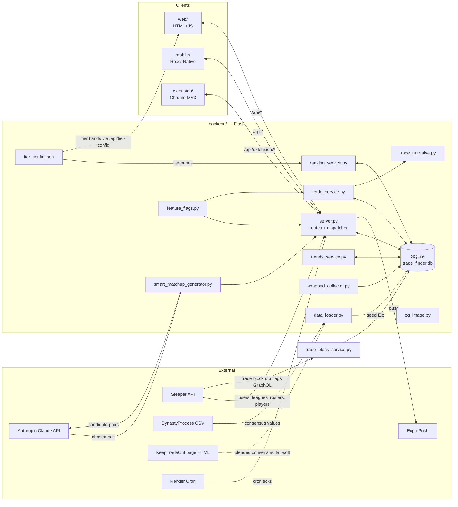

# Architecture

High-level data flow and component boundaries. Update when modules are added, removed, or significantly re-wired.

## Data flow

## Components

### Backend (`backend/`)

| Module | Lines | Role |
|---|---|---|
| `server.py` | ~6.4k | Flask routes, session management, Sleeper passthrough, in-memory ring-buffer debug log (`/api/debug/log?n=100`), typed push dispatcher (`_send_typed_push`) with prefs/dedup/quiet-hours, cron tick handlers |
| `database.py` | ~5.2k | SQLAlchemy Core schema (22 tables), `_migrate_db()` idempotent ALTERs, `_MODEL_CONFIG_DEFAULTS` seeded via INSERT OR IGNORE; mirror/fuzzy match check (`check_for_match`); `record_event()` dual-write (user_events + `users.last_*_at`). Analytics P0 ([ADR-007](adr/adr-007-first-party-analytics-experimentation.md)): three engines on one DB — product `engine` (SQLite: WAL + `synchronous=NORMAL` + `busy_timeout=5000` via on-connect listener), `ingest_engine` (150 ms lock budget, `BEGIN IMMEDIATE`; = product engine on Postgres), read-only `ro_engine` (`mode=ro` URI / `default_transaction_read_only`) — plus `analytics_boot_status()` / `wal_file_bytes()` health probes |
| `ranking_service.py` | ~860 | Elo math; pairwise + 3-player decomposition; `tier_bands_for` + `apply_tiers` read from `tier_config.json` |
| `trade_service.py` | ~2.1k | Cross-user mutual-gain trade discovery. Two paths: **v2 engine** (flag `trade_engine.v2` — single value space, marginal valuation, two-sided surplus gate, harmonic ranking) and the **legacy scorer** as flag-off fallback (mismatch/fairness weights, package diminishing returns, flag-gated QB/star/clogger taxes). The old `team_outlook_multiplier` and `positional_preference_multiplier` are **deleted**: outlook is now a now/future valuation *blend* (`trade.outlook_blend`, v2-only; legacy ignores outlook), and positional preferences are a *hard filter* on candidate packages in both paths |
| `trade_optimizer.py` | new | Tier 3 engine module (flag `trade_engine.v3`): exact per-pair package search + sweetener pass + 3-team cycle clearing (`trade.three_team`). Flag-selectable — off falls back to v2, then legacy |
| `trade_narrative.py` | ~100 | Deterministic template-based rationale strings for trade cards. No LLM. Used by `trade_service.generate_trades()` to fill `TradeCard.narrative` |
| `smart_matchup_generator.py` | ~530 | Claude-assisted matchup picker + algorithmic fallback. Includes `community_trio_signal` + `find_qc_trio` for QC checks |
| `data_loader.py` | ~560 | Pulls DynastyProcess CSV; maps consensus values → seed Elo. Since #145/#148 **blends KeepTradeCut** into the DP baseline before seeding (`_apply_consensus_blend`): KTC's `dynasty-rankings` page HTML is scraped once/boot (`parse_ktc_players`, 24h TTL, fail-soft → DP-only), rank-normalized onto the DP value curve, weighted by `ktc_blend_weight`; `sf_tep` TE seeds get the `tep_te_uplift` premium. KTC↔DP matching reuses the DP `db_playerids.csv` crosswalk (`espn_service.get_crosswalk`, now also exposing `by_ktc_id`/`by_mfl_id`). `load_consensus_maps` also returns a per-name DP position map — the DP↔Sleeper name join is position-strict (#127: never name-match across positions; two NFL players can share a normalised name, e.g. Kenneth Walker WR vs Kenneth Walker III RB) |
| `espn_service.py` | ~470 | ESPN league-linking adapter (flag `espn.link`): unofficial v3 API reads (browser-signature headers, injected `_opener`), payload parsing, and the DP `db_playerids` crosswalk (24h-TTL in-memory cache, snapshot fallback) that maps ESPN rosters → Sleeper player ids. **Also the shared crosswalk home** (multi-platform linking): `get_crosswalk` now exposes per-platform id maps (`by_mfl_sleeper`, `by_sportradar_id`, `by_yahoo_id`) + the generic `map_generic_rosters` used by MFL/Fleaflicker. Consumed by `/api/espn/*`; live smoke: `python3 -m backend.espn_service <league_id> [season]` |
| `mfl_service.py` | ~330 | MFL league-linking adapter (flag `mfl.link`): official export API reads, per-league `wwwNN` host resolution (URL parse or `api.` 302), payload parse (`league`/`rosters`/`players`/`futureDraftPicks`, single-item dict normalization), `mfl_id` crosswalk, and raw future-pick capture. Consumed by `/api/mfl/*`; live smoke: `python3 -m backend.mfl_service <league_id_or_url> [year]` |
| `fleaflicker_service.py` | ~230 | Fleaflicker league-linking adapter (flag `fleaflicker.link`): zero-auth public JSON API reads (`FetchLeagueStandings`/`FetchLeagueRosters` + email-based `FetchUserLeagues`), `sportradar_id` crosswalk from roster `externalIds`. Consumed by `/api/fleaflicker/*`; live smoke: `python3 -m backend.fleaflicker_service <league_id \| email>` |
| `trends_service.py` | ~420 | Risers/fallers, contrarian, consensus-gap; reads `elo_history` |
| `wrapped_collector.py` | ~70 | **Frozen** (analytics P0 cutover, LLD §6.4): its `record_event()` wrote `wrapped_events`, which now receives zero writes — all five former callers route through `database.record_event()` into `user_events`. Kept only until the module is retired |
| `analytics_taxonomy.py` | ~120 | Analytics P0: single source of truth for event names — `ALLOWED_CLIENT_EVENTS` (POST /api/events allowlist), `SERVER_FIRED_EVENTS`, `FUNNEL_CRITICAL` (SDK overflow retention). Asserts client/server namespace disjointness at import |
| `og_image.py` | ~690 | Open Graph share images (1200×630 PNG) for tiers and trades |
| `feature_flags.py` | ~220 | Reads `config/features.json`; supports `FTF_FLAGS` env override; `/api/feature-flags/reload` re-reads at runtime |
| `trade_block_service.py` | new | FB-147 — imports Sleeper trade-block state. Reads the **public** GraphQL `league_players` query (`settings.otb` = flagging roster_id, `settings.otb_added_at` = epoch ms; unauthenticated, unlike the write surface in `sleeper_write.py`), validates each flag against v1 rosters (drops Sleeper's stale flags; skips pick pseudo-ids), and replace-syncs the `trade_block` table. Called by `session_init`'s background daemon behind flag `sleeper.trade_block`. **Engine hook (WIRED, FB-147): `trade_service._load_on_block_by_uid` reads `database.load_trade_block(league_id)` and `_generate_trades_v2` applies a SOFT, acquire-side `block_boost` (flag `trade.block_boost`, knob `block_boost_weight`) — a card whose acquire side holds a counterparty-flagged player gets a bounded post-gate composite bump, mirroring `need_fit` (reorders acceptable trades, never rescues a gated one). See [feedback/items/147-trade-blocks/engine-hook.md](feedback/items/147-trade-blocks/engine-hook.md).** This module only imports + stores; `server.trade_card_to_dict` still stamps the display-only `on_block` field (which boosted cards reuse for client inspectability). |
| `entitlements.py` | ~380 | Monetization foundation ([plan](plans/monetization/00-platform-foundation.md)): entitlement resolution (`get_entitlements`, working-key ↔ account bridge), flag-aware `check_pro` (off / ENTITLE-OBSERVE / enforce), grant/revoke/list (manual-grant routes wrap these), and the billing pipeline (`ingest_billing_event` → `subscription_events` ledger → projector → `entitlements`). All dark behind `monetize.*` flags; routes are thin wrappers in `server.py` (`/api/me/entitlements`, `/api/admin/entitlements/*`, `/api/billing/*`) |

### Backend support files

- `backend/tier_config.json` — **single source of truth for Elo tier bands**, keyed by `(scoring_format, position, tier)` with `[min, max]` ranges. Read by `ranking_service.tier_bands_for` + `apply_tiers` on the server; served to the web SPA via `GET /api/tier-config` so the frontend buckets players the same way. Replaces the old `UNIFORM_TIER_ELO_BANDS` / `QB_TE_1QB_TIER_ELO_BANDS` class constants.
- `backend/scripts/` — one-off maintenance + offline validation scripts: `rescale_pick_values.py`, `replay_trade_decisions.py` (legacy-vs-v2 replay of historical decisions), `calibrate_elo_value.py` (Spearman check of `elo_to_value` vs the legacy `dynasty_value` curve).
- `backend/tests/` — pytest suite for non-trivial pure logic: `test_pick_value_scaling.py`, `test_roster_profile.py`, `test_trade_narrative.py`.

### Clients

| Client | Path | Stack | Talks to |
|---|---|---|---|
| Web SPA | `web/` | Vanilla HTML/CSS/JS | `/api/*` (same origin) |
| Mobile | `mobile/` | React Native + Expo | `/api/*` (network) |
| Extension | `extension/` | Chrome MV3 | `/api/extension/*` (bearer token) |

### Skills (development tooling)

- `.claude/skills/feature-evaluator/` — Claude Code skill that reviews a feature area and emits an improvement report.
- `.claude/skills/project-reorganizer/` — Claude Code skill that reorganizes a flat project into a conventional layout.
- `.claude/skills/project-architect/` — Claude Code skill that generates and maintains the reference-docs layer.

Throwaway eval workspaces and packaged `.skill` bundles are archived in `archive/skill-workspaces/`.

## Request lifecycle (typical ranking flow)

1. Client `GET /api/trio` → `server.py` calls `smart_matchup_generator.py`.
2. SMG fetches live Elo via `ranking_service.py`, builds ~10 candidates respecting tier engine settings (`tier_engine_enabled`, `tier_size`, mix-in rates), optionally consults Claude.
3. Returns `(player_a, player_b, player_c)`.
4. User orders best→worst; client `POST /api/rank3` with the ordering.
5. `server.py` decomposes into 3 pairwise updates → `swipe_decisions` rows + Elo updates → `member_rankings` snapshot + `elo_history` row per changed player.
6. `database.record_event('trio_swipe', …)` writes `user_events` and bumps `users.last_active_at` / `last_rank_at` / `events_count` (+ the ranking streak).
7. Returns updated progress; client repaints the bar.

## Request lifecycle (trade card — v2 engine, flag `trade_engine.v2`)

1. Client `POST /api/trades/generate`; `server._run_trade_job` runs in a daemon thread, loads real league-mate rankings (`member_rankings`), the user's per-player comparison counts (`service.comparison_counts()` — Tier 1 confidence threading), outlook + positional prefs.
2. **Value space:** the user's Elos are shrunk toward consensus seed by comparison count (`w = n/(n+shrink_pseudocount)`), then mapped to dynasty-value units via `elo_to_value` (exponential). Opponents with no real rankings are NOT scored in divergence space (their Elos would be fabricated noise) — they get **consensus-basis** cards instead (`basis="consensus"`, fairness × tier multiplier only).
3. **Marginal valuation** (`trade.marginal_value`): each asset is valued over the receiving roster's per-position replacement level, plus a `bench_credit_rate` credit; **outlook blend** (`trade.outlook_blend`) tilts the user's values now↔future by age curve and α per outlook. Positional preferences act as a hard filter on packages.
4. **Mutual-gain gate + harmonic ranking:** packages are valued KTC-style in *each side's own* value space (`package_value_v2`), the side receiving more players pays `waiver_slot_cost` per extra slot, and a trade surfaces only when BOTH sides' surpluses clear `min_side_surplus(_marginal)`. Candidates rank by the harmonic mean of the two surpluses blended with range-overlap consensus fairness, kept in a bounded top-K heap. No QB/star/clogger taxes in this path.
5. **Likes-you injection** (`trade.likes_you`): cards whose mirror a league-mate already liked are flagged/synthesized and pinned to the top (cap 3).
6. **Thompson ordering** (`trade.thompson_deck`): per-shape Beta(1+likes, 2+passes) samples reorder the deck within a bounded (0.5, 1.5) multiplier; **diversification** (`trade.deck_diversity`) penalizes league-saturated targets and caps cards per target.
7. **Impressions logging:** the final served deck is written to `trade_impressions` (one row per card, true positions), once per job.
8. `trade_narrative.build_narrative()` fills `TradeCard.narrative`; cards served via `GET /api/trades` / job snapshots.

**Tier 3** (`trade_engine.v3`, flag-selectable): `backend/trade_optimizer.py` replaces step 4's enumeration with an exact per-pair package search, adds a sweetener pass for near-miss-fair trades, and (behind `trade.three_team`) 3-team cycle clearing. Off → v2.

**Legacy path** (`trade_engine.v2` off — kill-switch fallback, byte-for-byte unchanged): mismatch (user-Elo gap) and fairness weighted `0.70 / 0.30`, fixed package diminishing weights (`package_value`), flag-gated QB/star/clogger taxes, filters by `min_mismatch_score`, `max_value_ratio`, `trade_elo_gap_max`. Outlook is ignored; positional preferences are the same hard filter.

## Request lifecycle (trade match)

1. Either user `POST /api/trades/swipe` with `like`.
2. `server.py` checks for a mirrored existing like from the other side (`database.check_for_match`). With flag `trade.fuzzy_match`, a near-mirror also matches: Jaccard ≥ `fuzzy_match_tau` (0.8) per side, and only low-value players (`search_rank ≥ 120`) may differ.
3. If found: insert `trade_matches` row (status `pending`), insert two `notifications` rows, dispatch typed push for both users.
4. Either user `POST /api/trades/matches/<id>/disposition` with `accept` or `decline`. Updates `user_a_decision` / `user_b_decision`; rolls `status` → `accepted` / `declined` once both have decided (or any user declines).
5. Counterparties receive `trade_accepted` / `trade_declined` notifications + push.

## Push dispatcher

`_send_typed_push(user_id, kind, title, body, data, dedup_key)` is the single entry point.

1. Resolve `kind` → bucket via `get_pref_bucket()`. If the user's `notification_prefs` toggle for that bucket is off → drop.
2. Check `notification_events_log` for `(user_id, kind, dedup_key)`. If duplicate → drop.
3. If `quiet_hours_enabled = 1` and now is in the user's quiet window → insert into `notification_queue` with `deliver_after = next 8am local` and return.
4. Otherwise: send via Expo to all `device_tokens` for the user; append a row to `notification_events_log`.

## Cron ticks

External scheduler (Render cron) hits four endpoints:

| Endpoint | Cadence | What it does |
|---|---|---|
| `POST /api/cron/realtime-tick` | every 1–5 min | Drain `notification_queue` rows whose `deliver_after` has passed |
| `POST /api/cron/hourly-tick` | hourly | Bundle drain + quiet-hours summary push at user's local 8am |
| `POST /api/cron/daily-tick` | once daily | Weekly digests + re-engagement scans (`winback_dormant`-style kinds) |
| `POST /api/cron/value-snapshot` | once daily | Upsert consensus value of every universal-pool player into `player_value_history` (#57). Kept separate from `daily-tick` so a push-scan failure can't stop history collection. |

## Event recording

`record_event(user_id, event_type, props=…)` in `database.py` does a dual-write:

1. Append to `user_events` (full structured row with device/source/session/league context; `event_id` stays NULL — server-fired rows never need an idempotency key).
2. Update the matching `users.last_*_at` denormalized column, plus `events_count`, `last_device_type`, `last_os_version`, `last_app_version` (and the ranking streak for `_RANK_STREAK_EVENTS`, which includes `tier_save` since the P0 cutover).

Client-fired events arrive via `POST /api/events` (allowlist in `analytics_taxonomy.py`, per-device rate limit, `event_id` dedup against the full unique index) and land in the same `user_events` lineage with the envelope columns populated — never through `record_event()`, which would double-bump the denorm columns. Health counters for the ingest path are served by `GET /api/admin/analytics/health`.

Hot-read endpoints (inactivity scans, "last login" lookups) read the denormalized `users.*` columns. Analytical reads scan `user_events` via the `(user_id, occurred_at)`, `(event_type, occurred_at)`, or `(device_id, occurred_at)` indexes.

## Tier bands flow

1. `backend/tier_config.json` is the single source of truth.
2. Server boots → `ranking_service` loads it via `_load_tier_config()`.
3. `apply_tiers` spreads Elos linearly inside each `[min, max]` band per `(scoring_format, position, tier)`.
4. Web SPA `GET /api/tier-config` → buckets players client-side using the same `[min, max]` ranges (top-down walk). This guarantees server and web tier assignments match.
5. Mobile + extension use their own `tierBands` constants — keep in sync with this file (see [cross-client-invariants.md](cross-client-invariants.md)).
