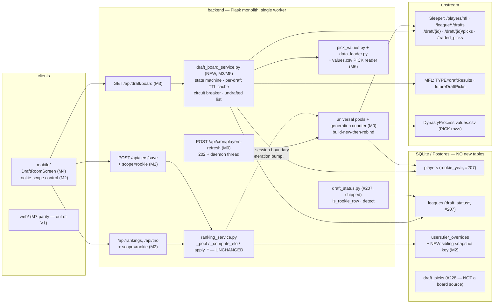

# HLD — Rookie Rankings + Live Draft Support

**Date:** 2026-08-05 · **Status:** Draft for build briefing
**Parent (normative):** [plan.md](plan.md) — **FINAL, dual-agent converged, 4 rounds.** Every decision in it is settled; nothing here re-opens one. D1–D10, M0–M8, O1–O10 references resolve to that document.
**Grounding:** code read on `origin/main` (`e98560a`, `0118efc` — #207 shipped). Local `teardown-remediation` lags; every file:line below is an `origin/main` line. Claims the plan verified against live endpoints and that no local artifact can confirm are marked **ASSUMPTION (plan-verified live)**.
**Method:** every component states failure mode → degradation → blast-radius bound, per the analytics-platform HLD precedent. A component that can't state all three isn't designed.

---

## 1. Context & Goals

### 1.1 Stance

The plan's objective is two features that share one substrate: **rookie-scoped ranking** (a view over the ONE existing per-user-per-format board) and a **read-only Draft Room** (Sleeper + MFL). Both sit on a data pipeline that, today, cannot refresh — which is why M0 is the feature's real foundation, not a chore.

The design goals inherit the host's constraints, not the feature's ambitions:

- **G-A (the board is sacred).** `users.tier_overrides` is a wholesale-overwritten JSON blob with no history (`backend/database.py:3269-3298` — `save_tier_overrides` writes `all_overrides[fmt] = {...}` and `UPDATE`s the whole column). A prior filtering bug already destroyed a user's board once; the code carries the postmortem as a 20-line comment (`backend/server.py:11730-11750`). Every scoped write path must be provably non-destructive **before** the flag can flip, and a restore path must exist first (D3).
- **G-B (never invent).** A pre-draft Sleeper draft object has `draft_order: null` and the identity `slot_to_roster_id` trap; a flaked read is indistinguishable from an empty one (`backend/server.py:9186-9202` returns `[]` on both). Honest-state rendering beats a plausible guess everywhere (D5, D7).
- **G-C (a refresh must not be felt).** One Flask process, one worker (free Render plan, O8 pending). A background refresh that blocks a request worker, or clears a pool in place, converts a data-freshness win into an availability incident (D1).
- **G-D (flag-off is byte-identical).** Five new flags, all landing OFF. With every flag off, the same build must serve responses indistinguishable from today's (D4).

### 1.2 Constraints from the real codebase (verified)

| Fact | Where | Consequence |
|---|---|---|
| Player cache has **no TTL**; only fetched on file-miss | `backend/server.py:406-419` (`_load_sleeper_cache` early-returns on the module global; disk read only when the global is `None`) | M0 must add the refresh path that does not exist |
| The 24 h sync gate **re-syncs from the same stale file** | `backend/server.py:697-720` (`_maybe_sync_players`: `needs_player_sync()` → `_load_sleeper_cache()` → `sync_players(cache)`) + `backend/database.py:6684-6705` | Freshening the DB requires freshening the *file* first — the gate alone is a no-op loop |
| Universal pool is **frozen per process** | `backend/server.py:1324-1325` — `if g_universal_by_format.get("1qb_ppr") and g_universal_by_format.get("sf_tep"): return` | A refreshed player table is invisible until redeploy → generation counter |
| Legacy globals are mutated **in place** | `backend/server.py:1403-1407` — `g_universal_players[:]`, `g_universal_seed.clear()/.update()`, `dp_values.clear()/.update()` | A background mutator over these is a torn-read generator → build-new-then-rebind |
| `_player_sync_lock` guards **sync only**, never pool readers | `backend/server.py:1482` | Single-flight guard on `_ensure_universal_pools` is a separate lock |
| Services rebuild on **user change only** | `backend/server.py:11688` — `need_rebuild = existing_services is None or existing_tagged_user != user_id` | This is the session boundary D1's membership-only rebuild rides |
| Rookie predicate exists **twice**, and a third looser one is shipped | `backend/draft_status.py:94-108` (`is_rookie_row`), SQL mirror `backend/database.py:6915-6939` (`load_rookie_player_ids`), and the LOOSE `load_rookies()` at `backend/database.py:6886-6912` (`years_exp == 0 OR years_exp IS NULL`, **no team requirement, no `rookie_year` test**) | Pin one predicate in cross-client-invariants; rebase onto `load_rookie_player_ids`; retire `/api/rookies` in M4 |
| Sleeper fixture seam only intercepts `_sleeper_get` | `backend/server.py:476-511`; path derived by splitting on the literal `api.sleeper.app/v1/` | Draft endpoints replay for free; **the bulk players fetch does not** (§6, RB-2) |
| MFL has no env fixture seam — it uses `_opener` injection | `backend/mfl_service.py:281-303` | M1's MFL fixtures are a different mechanism (§6, RB-3) |
| `#228` deletes the current season's `draft_picks` rows once `drafted` | Sleeper `backend/server.py:8149-8156` (`exclude_seasons`), MFL `backend/server.py:8051` + `8078-8079`, both through `replace_draft_picks` (`backend/database.py:7209-7228`) | The Draft Room must never source the live/recap board from `draft_picks` — it empties at the finish line |
| Thin pools 400 today | `backend/ranking_service.py:391-392` raises `ValueError`; `backend/server.py:4964-4966` catches → `400 bad_request` | M2's typed-empty contract is a genuine behavior change on the scoped path only |
| `apply_reorder` is already subset-safe | `backend/ranking_service.py:1362-1387` — permutes the submitted subset's own Elos, writes only submitted pids | Do not "fix" it; only the tiers lane needs new construction |
| Every flag defaults `False`; unknown keys are ignored with a warning | `backend/feature_flags.py:357`, `:382-399`, `:454-456` | A flag missing from `FLAG_KEYS` can never be enabled — the 4-touch convention is load-bearing |

**Simplest design that satisfies the plan:** *one* new backend module (`draft_board_service.py`), *one* new route, *one* new mobile screen + one shared scope control, a refresh path inside `server.py`, a values.csv reader inside `data_loader.py`, and **zero** new tables, deployables, cron jobs, or datastores. Anything else is rejected in §4.

---

## 2. Architecture Overview

### 2.1 Component map



**Deliberately absent:** no new table, no new cron service, no queue/worker/broker, no websocket, no client-side rookie filter, no second Elo space, no manual draft-status override (O9). Each absence is a stated failure mode chosen over a maintenance mode.

### 2.2 Components: responsibility → failure envelope

| Component | Responsibility (owns) | Failure mode → degradation → blast-radius bound |
|---|---|---|
| **Cache-refresh path** (M0, in `server.py`) | Daily-tick handler acquires `_player_sync_lock` (`server.py:1482`), spawns a **daemon thread**, returns `202`. Thread: fetch `/v1/players/nfl` → temp file + atomic rename → in-order invalidation (disk → `_sleeper_cache` → `sync_players` → DP maps → pools **build-new-then-rebind** → generation bump). | Upstream 5xx/timeout → nothing is written, cache-file mtime unchanged, counter increments, next tick retries. Partial write is structurally impossible (rename is atomic). Thread crash → the lock is released in `finally`; the next tick re-enters. **Bound:** zero request-worker time (D1's p95 clause), one in-flight refresh process-wide, and a refresh that fails leaves the *previous* consistent world intact — never an empty pool. |
| **Generation counter** (M0) | A monotonically-increasing `int` bumped on pool rebind. `_ensure_universal_pools` gains a **single-flight guard** (its own lock, not `_player_sync_lock`, which serializes syncs only). Membership-only semantics: existing members carry prior seed Elo forward (D1). | A missed bump = a user sees the old membership until their next session — the pre-M0 status quo, not a regression. A spurious bump = one extra rebuild at one session boundary. **Bound:** the counter is read only at `server.py:11688`'s rebuild decision; nothing mid-session reads it, so no ranking session can move under a user. |
| **Rookie-scope view filter** (M2, `server.py` response/selection layer) | `scope=rookie` applied **after** `_compute_elo`, on the response set and on trio candidate SELECTION. `_pool`/`_compute_elo`/`apply_reorder`/`apply_anchor`/`apply_tiers` stay on the full position pool. Every scoped WRITE derives from full-pool Elo. | A scope bug degrades to *fewer rows shown*, never a different Elo — D2's identity test is the proof. A lane that bypasses the seam (`_cross_position_trio` at `ranking_service.py:586`, the QC-trio path at `server.py:4892-4896`) is re-scoped or disabled under scope; if neither, it must 200-empty rather than leak vets. **Bound:** flag off ⇒ the query param is never read ⇒ D4 byte-identity. |
| **Merged-band tier save** (M2) | The one construction satisfying D2 (write-identity) and D3 (no respread): merge scoped pids into the current full-band order → spread linearly over the FULL list → persist overrides for scoped pids only. Never calls `save_tiers_position`. `demoted_pids` scoped to the visible subset (#161, O4). | A construction bug is *board corruption*, the highest-severity outcome in this design. Mitigations are structural: verify-failing-first regression tests (D3), a pre-scope snapshot with an operator restore path as a **flag precondition**, and `via:'rookie_*'` tagging so damaged saves are identifiable after the fact. **Bound:** untouched members' overrides byte-unchanged; `tiers_saved`/`all_done` untouched, so LeagueScreen's ranked count, `quicksetProgress`, the web celebration, and #244 launch routing cannot misfire. |
| **`draft_board_service.py`** (NEW, M3 + M5) | One versioned payload for all states; poll `last_picked` on the 1.2 KB draft-detail object and fetch the 20 KB `/picks` only on change; per-draft shared TTL cache (20 s drafting / 5 min pre / 24 h complete); circuit breaker + budget counter; undrafted list from `players.rookie_year` (D7); MFL `draftResults` parity (D8). | Upstream failure → serve the last cached payload with `stale:true` + `as_of`, or `state:"unavailable"` when there is nothing cached. Breaker open → `state` preserved, `stale:true`, client falls back to a manual Refresh. **Bound:** N viewers of one draft ⇒ ≤1 upstream read per TTL ⇒ ≤3 req/min/draft (D6); the fan-in guarantee is **per process** — it multiplies by worker count if O8 upgrades. Never writes to any platform (D9); never writes `draft_picks`. |
| **DP `values.csv` reader** (M6, in `data_loader.py`) | Read PICK rows (`2026 Pick 1.01…`) from `files/values.csv`; serve per-slot values on the draft board **and only there**, behind `picks.slot_values` (default OFF). | Fetch failure → the field is absent from the payload; the board renders without the slot-value axis. **Bound:** `GENERIC_PICK_SEEDS` (`backend/pick_values.py:24`), the 8-tier ladder, tier bands and the trade engine are untouched — adoption is a separate repricing decision (O2). A second remote file needs its **own** env override; `FTF_TEST_MODE` today only pins `values-players.csv` (`backend/data_loader.py:504-507`). |
| **Mobile Draft Room + scope control** (M4 + M2's client half) | Root-stack push route (the `FreeAgents` pattern), entry = the `league.rookie_board_entry` tile **conditionally replaced** on `draft.room`; ONE shared scope control (the `rankChooserModel` shared-content-model precedent), session-only (#133). | A render failure is one screen; the Explore tile falls back to today's rookie-board sheet when `draft.room` is off. Live polling behind a **separate** flag (`draft.live_poll`) so the room ships without it. **Bound:** background/blur pass threshold is literally **zero** requests; `refetchInterval` has no precedent in this app, so request counts are instrumented in QA, not assumed. |

### 2.3 Interactions — sync vs async

Everything on a request path is synchronous. The design's only asynchrony is **two daemon threads**, both already-precedented in this codebase (`server.py:1484-1499`'s trade-job daemons; `#207`'s session-init draft-status daemon):

- **M0 refresh:** cron POST → 202 → daemon thread. Never awaited. Never touches a request worker.
- **M3 upstream reads:** synchronous within the `/api/draft/board` request, but fan-in-cached, so the *cache miss* is the only path that waits. Cache hit is a dict read.
- **Client → board:** M4's 15 s interval hits **our** endpoint, never Sleeper. Focus- and state-gated; hard stop on background.
- **Generation → service rebuild:** never pushed. Read once, at `server.py:11688`, on the next session boundary.

---

## 3. Data Model & Flow

### 3.1 Entities — nothing new

| Entity | Status | Use |
|---|---|---|
| `players.rookie_year` | Shipped #207 (`backend/database.py:643`, populated `:6771-6798`) | THE rookie-class source for scope + the undrafted list |
| `leagues.draft_status` / `_confidence` / `_checked_at` | Shipped #207 (`backend/database.py:265-267`) | Board state corroboration; TTLs at `backend/server.py:9220-9224` |
| `draft_picks` | Shipped #158/#228 | **Pre-draft ownership only.** Never the live/recap board — #228 deletes the season's rows on `drafted` |
| `users.tier_overrides` | Shipped | The board. Written by the scoped save |
| `users` JSON column, **new sibling key** | M2 | The one-time pre-scope snapshot. Same column, same row, no new datastore, no new table — data-dictionary entry required |

**Storage decision.** The snapshot is a sibling key inside the existing `users` JSON column rather than a table because it is a *one-shot, per-user, per-format* artifact with no query surface: it is written once (before the first scoped save), read only by an operator restore, and never joined. A table would add a migration, a data-dictionary entry, and a retention question to buy indexing nobody needs.

### 3.2 Flow A — the three draft states

All three produce the same `schema:1` envelope; only `state` and which arrays are populated differ. The **divergence rule** is invariant across all three: *the draft object is truth for the board; `draft_picks` is truth for pre-draft ownership; V1 never writes one from the other.*

**A1 — `upcoming` (pre-draft).** `GET /v1/league/{id}/drafts` → the current-season rookie-shaped draft. If `draft_order != null`: render true slots, overlay `traded_picks` (`server.py:9170-9183`, available pre-draft) to show who actually picks at 2.03. If `draft_order == null`: render the honest **"order not set"** state — round-level ownership from `draft_picks` only, and **never** an invented order. The pre-draft identity `slot_to_roster_id` map is the trap D5 unit-pins: it looks like a real order and is not. TTL 5 min.

**A2 — `live` (drafting).** Poll the **draft-detail object** (~1.2 KB, `s-maxage=30`) for `last_picked`; fetch `/picks` (~20 KB) **only when it changes**. TTL 20 s, shared per draft: N viewers ⇒ 1 upstream read per TTL. Undrafted = `rookie_year == season` − drafted − rostered. `as_of` always in the payload; `stale:true` whenever the last successful read is older than TTL×2. **ASSUMPTION (plan-verified live):** the CDN TTLs and the never-poll-`/picks`-directly rule come from the plan's live probes; no local artifact confirms them, and M3's first task is to re-confirm both against fixtures + one live read.

**A3 — `complete` (recap).** `/picks` is CDN-cached ~24 h; TTL 24 h. Full board renders from the pick list, which carries `player_id` in our own id space and `roster_id` joining straight to rosters. This is the state the Lakeview fixture pins (D5).

**A4 — designed non-states.** `startup` (rounds-shape from `draft_status.ROOKIE_MAX_ROUNDS`/`STARTUP_MIN_ROUNDS`, `backend/draft_status.py:65-66`) is **labeled** and the rookie undrafted list is suppressed — never rendered as a rookie draft. `unavailable` covers ESPN/Fleaflicker and any platform with no pick model. The **pre-class-load** state (Feb–Apr 2027, structurally empty) is a client-side designed state with a "show last year's class" toggle, backed by M0's class-load monitor.

### 3.3 Flow B — the scoped-rank path

```
GET /api/rankings?position=RB&scope=rookie
  ├─ flag ranks.rookie_subset OFF → param never read → today's response, byte-identical (D4)
  └─ ON:
     1. service.get_rankings(position)          ← FULL pool, ranking_service.py:669-697
     2. elo = _compute_elo(FULL pool)           ← every rookie-vs-vet swipe included
     3. rankings = [...] + #207 rung relabel + enrichments   ← unchanged, server.py:5248-5303
     4. rookie_ids = load_rookie_player_ids(season)          ← database.py:6915
     5. response.rankings = [r for r in rankings if r.id in rookie_ids]   ← THE seam
        (+ generic pick rungs, year-labeled, listed after players — O10 = YES)
```

The seam is at step 5 and **only** step 5. The plan's round-2 catch is the whole reason: filtering `_pool` instead would drop every rookie-vs-vet swipe out of `_compute_elo`, silently forking the Elo space. D2's test — *for every rookie pid, scoped Elo == unscoped Elo exactly* — is the executable statement of that.

**Writes derive from full-pool Elo.** `apply_reorder`/`apply_anchor` are already correct on a subsequence (`ranking_service.py:1362-1387`, `:1327-1343`). The tiers lane is not, and gets the merged-band construction (LLD §4.3). Trios: candidate *selection* filters; Elo updates from picks are unchanged full-board updates.

### 3.4 Critical edge paths

- **Refresh vs. active session.** A generation bump changes membership only; seeds carry forward; no service is rebuilt mid-session. A user ranking during a refresh sees a fully consistent old world until they re-init.
- **Refresh vs. concurrent `_ensure_universal_pools`.** The single-flight guard means the daemon and a request worker cannot both fan out DP fetches. Build-new-then-rebind means a reader mid-swap sees either the whole old pool or the whole new one, never an empty one.
- **Scoped save vs. leaguemates.** The scoped path must **never** pass scope into `upsert_member_rankings` (`backend/database.py:5609`) — leaguemates' trade math reads that row, so a scoped publish is a cross-user blast radius. It publishes the full board, exactly as the unscoped save does (`server.py:6410-6424`).
- **Draft completes mid-session.** `#228` drops the season's `draft_picks` rows on the next sync; the room, reading the draft object, is unaffected. Any consumer that read `draft_picks` for the live board would empty at the finish line — hence the divergence rule.
- **Stale board vs. live claim.** MFL auth failure serves the stored snapshot plus a "reconnect MFL" notice with `as_of` — never stale-as-live.
- **Empty scoped pool.** Typed `200 {empty:true, reason}`, never today's `ValueError → 400`. A thin TE class (possibly <5, per M0's measurement) is the expected trigger, not an error.

---

## 4. Key Design Decisions (mini-ADRs)

These restate the plan's settled decisions as design rationale, with the alternative that was rejected. **None is open.**

**KD-1 — New domain = new module; `server.py` gains thin shims only.** `draft_board_service.py` is a flat module beside `ranking_service.py`/`trade_service.py`. *Rejected:* inlining a state machine + cache + breaker into a 17.9k-line file; a `backend/draft/` package (the repo convention is flat modules).

**KD-2 — Scope is a post-Elo VIEW filter, never pool membership.** One Elo space, one board, one set of tier bands. *Rejected:* a separate rookie Elo space (breaks tier colors, trade values, #161 demotion, and adds a 5th cross-client mirror); filtering `_pool` (forks the Elo space, §3.3); a client-side filter (5 clients would each mirror the predicate — the exact drift class `cross-client-invariants.md` exists to prevent).

**KD-3 — Write-identity is split by write SHAPE.** Permutation-shaped writes (`apply_reorder`, `apply_anchor`) are byte-identical to the equivalent unscoped action on that subsequence — they already are. Tier saves get the merged-band rule. *Rejected:* a naive scoped-list spread (destroys boards by respreading rookies across the full band) and a full-band persist (destroys boards by rewriting untouched members). Both were shown mutually destructive in the plan's round 3; there is exactly one construction left.

**KD-4 — Refresh is a daemon thread with atomic rename, never inline.** Render "cron" is an HTTP POST into the single-worker web service. *Rejected:* inline refresh on the request worker (a ~5 MB fetch on the one worker is an availability incident); a real background worker (a second deployable to babysit); in-place `.clear()` of pool globals (hands a concurrent `session_init` an empty board).

**KD-5 — Generation bumps are membership-only; rebuilds happen at the session boundary.** The existing `need_rebuild` seam (`server.py:11688`) is the only rebuild trigger. *Rejected:* re-seeding on bump (moves a user's Elo mid-session); pushing rebuilds to live sessions (no push channel, and the failure mode is "the user's board changed under them").

**KD-6 — Honest states beat plausible ones.** `draft_order != null` gates any slot rendering; `stale`/`as_of` are always present; the unvalued rookie tail is rendered as "no consensus value", never dropped; startup drafts are labeled and degraded. *Rejected:* deriving an order from the pre-draft identity map (D5's pinned trap); dropping unvalued rookies (D7 — a rookie missing from the value pool would vanish from the one screen that exists to list them).

**KD-7 — No platform writes; the terminal CTA is a deep link.** Mis-picking in a live draft is irreversible harm, and no public write API exists. This is the #179 prepare-and-deep-link precedent. *Rejected:* any write path, under any flag.

**KD-8 — Fan-in caching is the whole scale story.** Per-draft shared TTL cache + poll-the-cheap-object-then-fetch-on-change. *Rejected:* per-viewer polling of `/picks` (20 KB × viewers × interval); a websocket (Sleeper's is private and uncommitted, O6); a dedicated ≤1-min poller for on-the-clock push (M7, needs cron cost).

**KD-9 — Slot values are display-only.** M6 serves them on the draft board and nowhere else. *Rejected:* engine adoption now — DP's current-year slot curve is much steeper than our shipped ladder (1.01 ≈ 1817 vs "Early 1st" 1720), so adoption is a **repricing** decision with the #214-toggle precedent, not a data plumb (O2).

**KD-10 — Per-milestone flags, all landing OFF, flipped at release gates.** `ranks.rookie_subset`, `draft.room`, `draft.live_poll`, `draft.mfl`, `picks.slot_values`. *Rejected:* one feature flag (M4 could not ship without live polling; `draft.live_poll` must be independently killable); flag-on-by-default for any of them.

**KD-11 — No second source of truth for draft status (O9).** No manual per-league override in V1. It would reintroduce exactly what #207 centralized. Revisit only on field evidence of confidence-tier misfires.

---

## 5. Cross-Cutting Concerns

### 5.1 Failure modes & the degradation ladder

Read top-to-bottom: each rung is what the user sees when the rung above fails.

| Rung | Trigger | What the user sees | Who owns it |
|---|---|---|---|
| 0 — normal | — | Live board, ≤30 s lag, `as_of` current | M3 |
| 1 — stale-but-honest | Upstream slow / TTL exceeded ×2 | Same board, `stale:true`, visible `as_of`, manual Refresh present | M3 |
| 2 — breaker open | N consecutive upstream failures / budget exceeded | Last good payload, `stale:true`, polling stops, Refresh remains | M3 |
| 3 — no cached payload | Cold process + upstream down | `state:"unavailable"` + honest copy; no fabricated board | M3 |
| 4 — order unknown | `draft_order:null` | "Order not set" + round-level ownership only | M3/M4 |
| 5 — class not loaded | Feb–Apr 2027 (`rookie_year == season` yields ∅) | Designed pre-class-load state + "show last year's class" toggle | M0 monitor + M4 |
| 6 — platform unsupported | ESPN / Fleaflicker | Explicit "not supported for this platform" | M3 |
| 7 — flag off | `draft.room` off | Today's rookie-board tile, unchanged | M4 |

Rookie scope has its own short ladder: thin pool → typed `200 {empty:true, reason}`; stale cache in dev (>7 days) → **refuse rookie scope** outside prod, exempting `FTF_TEST_MODE` (the Maestro harness runs a pinned cache file, `server.py:400-402`); flag off → the param is never read.

### 5.2 Scalability & performance

- **Single worker.** The only new *sustained* load is `/api/draft/board`. Client 15 s (focused + drafting) → per-draft TTL 20 s → **≤3 upstream requests per minute per draft, regardless of viewer count**. This bound is **per process**: if O8 upgrades to multi-worker, the budget multiplies by worker count and must be restated (RB-4).
- **Refresh cost.** One ~5 MB fetch + one `sync_players` pass + two DP fan-outs, all off the request path, once per day. D1's p95 clause is the acceptance test.
- **Scope cost.** One `load_rookie_player_ids(season)` call per scoped request — an indexed scan over `players` (`database.py:6915-6939`) — memoised per (season, process). Zero added cost on the unscoped path.
- **Cold start.** Render free-plan spin-down remains the unmodeled risk for anything called "live"; `draft.live_poll` ships OFF until the throwaway-league test passes, and O8 is the operator's call.

### 5.3 Security & auth posture

Three zones, unchanged from the app's existing model:

1. **Untrusted clients.** `/api/draft/board` carries `@_gate_unverified_read` (`backend/server.py:1918-1938`) — the same posture as `/api/rankings` (`:5240`). Scoped ranking requests inherit the gate of the route they ride. **Note the asymmetry to design around:** `/api/trio` carries **no** read gate today (`server.py:4857-4858`); adding `scope=rookie` there does not change its posture, but the LLD must state that explicitly rather than let a builder assume symmetry.
2. **Operator.** The refresh endpoint is `_require_cron_auth()` (`server.py:13058-13077`: constant-time compare, prod fail-closed with 503). The snapshot restore path is operator-only, by the same gate.
3. **Platform.** Zero writes (D9/KD-7). All Sleeper reads are unauthenticated public endpoints, the same trust level as `_fetch_sleeper_traded_picks`. MFL `draftResults` is zero-auth (**ASSUMPTION (plan-verified live)** on six public leagues); the authed path only ever reuses a stored cookie for a league the user already linked.

No new secrets. No new PII. The draft board contains only league-public data the platform already serves unauthenticated.

### 5.4 Observability

Rule inherited from the analytics HLD: **a degradation that produces no counter is a spec bug.** Minimum counters: refresh success/failure + cache-file mtime at boot (M0's dev guard logs it); generation value; pool-rebuild count; per-draft upstream fetch count + breaker state + budget consumption (D6's instrumented QA reads these); scoped-write count by `via:'rookie_*'`; class-load monitor alert on the first `rookie_year == next-season` row.

### 5.5 Testability

M1 exists so that M3–M5 are testable without a live draft. The replayer truncates a recorded pick list to *k* with a fake clock, making any in-progress state deterministic in CI. The `drafting` state is additionally observable on demand via an operator-created throwaway Sleeper league (O7) — which is a **release** gate for `draft.live_poll`, not a batch gate, so an operator slip cannot block a build wave.

---

## 6. Risks (residual, with the fix that bounds each)

1. **RB-1 — Board corruption via the scoped tier save.** The highest-severity risk in the design. Bounded by: the merged-band construction as the only sanctioned one; verify-failing-first regression tests (D3); the pre-scope snapshot + operator restore as a hard precondition for flipping `ranks.rookie_subset`; `via:'rookie_*'` tagging for forensics.
2. **RB-2 — The bulk players fetch is not on the fixture seam.** `_ensure_sleeper_cache_populated` uses **raw urllib** (`server.py:11439-11444`) and the code says so out loud (`:11431-11436`); `_sleeper_fixture_path` only rewrites URLs containing `api.sleeper.app/v1/` (`:476-478`). M0's refresh therefore cannot be replayed by the existing seam as written. Fix: route the refresh through `_sleeper_get`, or give it its own hermetic env override, **before** M0's tests are written. *This is a correction to the plan's implied mechanism, not to any decision.*
3. **RB-3 — MFL fixtures are a different mechanism.** `mfl_service` has no env fixture seam; it injects `_opener` (`backend/mfl_service.py:281-303`) and tests use committed snapshots (`backend/tests/fixtures/mfl_league_snapshot_2026-07-17.json`). M1's MFL half rides that pattern, not `FTF_SLEEPER_FIXTURES_DIR`.
4. **RB-4 — The fan-in guarantee is per-process.** Stated in the plan; restated here because O8 can invalidate the D6 budget without changing a line of code.
5. **RB-5 — The 2027 window is structurally empty.** Feb–Apr 2027 has no class to rank. Bounded by the designed pre-class-load state, the last-year toggle, the class-load monitor wired in M0, and M8's calendar-gated rehearsal.
6. **RB-6 — `refetchInterval` has zero precedent in this app.** M4 builds the first recurring-poll surface; the app-wide TanStack default is `refetchOnWindowFocus: false`. The pass threshold for background/blur is literally zero requests, verified by instrumentation, not by reading the code.
7. **RB-7 — Partial saves can cosmetically invert against stale neighbors** until the next full-band save. Inherent to any partial save (the plan's round-4 non-blocking note). One sentence in the build PRD; not a design change.
8. **RB-8 — There is no `conftest.py`.** ~~There is no CI.~~ *(Corrected 2026-08-18: CI does exist — `.github/workflows/ci.yml` runs `python -m pytest backend/tests -q` on every PR and push to `main`, alongside `mobile-typecheck` and `maestro-testid-lint`. The original claim was wrong when written or has since been overtaken.)* There is still no `conftest.py` anywhere in `backend/tests/`, so fixtures are wired per-file. The suite also runs by hand (`python3 -m pytest backend/tests/`). D10's "full suite green" is satisfied by CI; every milestone's exit should still state the command and expected counts.

---

## 7. Flag Topology & Rollout Order

```
ranks.rookie_subset ──── M2 ──── gated on: M0 measurement + pre-scope snapshot shipped + D2/D3 green
draft.room ───────────── M4 ──── gated on: M3 D5/D7 green on fixtures. Off ⇒ Explore tile unchanged
  └─ draft.live_poll ─── M4 ──── gated on: the throwaway-league live test (O7). RELEASE gate, not batch gate
draft.mfl ────────────── M5 ──── gated on: D8 on fixtures. Live mode additionally gated on a timed
                                  mid-draft probe; until then MFL ships upcoming + manual refresh
picks.slot_values ────── M6 ──── independent; display-only; never on the critical path
```

Every flag lands **OFF** and follows the repo's 4-touch convention (LLD §6). Rollout order is the dependency order, with two independent tails (`draft.mfl`, `picks.slot_values`). `draft.room` off restores today's `league.rookie_board_entry` tile — an unconditional swap would strand users with nothing.

---

## 8. Milestone Interfaces (so build waves can be briefed independently)

Each interface below is the **complete** contract a downstream wave needs; a wave can be built and reviewed knowing only its own interface and this table. **Hard rule across all of them: `server.py` is a single-writer resource — M0, M2, M3 and M6 each edit it, and never two concurrently.** Every wave `git pull`s first.

| Interface | Producer | Consumer | Contract |
|---|---|---|---|
| **I-1 Pool generation** | M0 | M2 | `pool_generation() -> int`, monotonic, bumped only on rebind. Read exactly once per session init, at the `need_rebuild` decision (`server.py:11688`). Membership-only: existing members' seed Elo unchanged across a bump. |
| **I-2 Rookie predicate** | M0 | M2, M3 | `load_rookie_player_ids(season) -> set[str]` (`database.py:6915`) is THE predicate, mirroring `draft_status.is_rookie_row` (`draft_status.py:94`). Recorded in `docs/cross-client-invariants.md`. `load_rookies()`/`GET /api/rookies` are the LOOSE legacy rule and are retired in M4. |
| **I-3 Rookie counts** | M0 | M2 | Measured valued-rookie counts per position per format, written into this folder. Gates rookie Trios and triggers the abort criterion at <15 in a format. |
| **I-4 Fixture corpus** | M1 | M3, M4, M5 | Named cassettes for: Lakeview complete (48 picks + `traded_picks` + `draft_order`), FFv3 pre-draft (`draft_order:null`, identity-map trap), MFL grids (made==0 / partial / complete / multi-`draftUnit`). Replayer truncates picks to *k* with a fake clock. |
| **I-5 `scope=rookie` request contract** | M2 | mobile (M2 client half) | Query param on `/api/rankings` + `/api/trio`; typed `200 {empty:true, reason}` on a thin pool; scoped save body carries `scope` and `via:'rookie_*'`; scoped saves never touch `tiers_saved`/`all_done`. |
| **I-6 `GET /api/draft/board` payload** | M3 | M4, M5, M6 | `{schema:1, state, kind, order[], picks[], undrafted[], my_picks[], order_confidence, as_of, stale}` — frozen at the end of M3's first batch. M5 emits the same shape from MFL; M6 adds one optional field per slot. |
| **I-7 Slot-value field** | M6 | M4 | One optional field on `order[]` entries; absent when the flag is off or the read failed. Rendering degrades to no axis. |
| **I-8 Snapshot + restore** | M2 | operator | Sibling key in the `users` JSON column + a documented operator restore procedure. **Precondition** for flipping `ranks.rookie_subset`. |

---

## 9. Deferred to the LLD

- Exact `/api/draft/board` field types, nullability, and enum members (§2 of the LLD).
- The merged-band algorithm in pseudocode, with the `tiers_saved`/`all_done` exclusion and #161 subset scoping.
- Generation-counter semantics, the single-flight guard's lock identity, and the exact invalidation order.
- Cache keys, TTL table, eviction policy, and breaker thresholds.
- Snapshot key name, JSON shape, and the operator restore command.
- Fixture directory layout, cassette naming, and the replayer's fake-clock interface — including the RB-2 fix for the bulk players fetch and the RB-3 MFL mechanism.
- Per-milestone test matrix, naming the verify-failing-first cases from D1–D10.
- The 4-touch flag checklist and the docs file each milestone must touch.
- Every place the LLD must be re-verified against a moved tree at build time.
