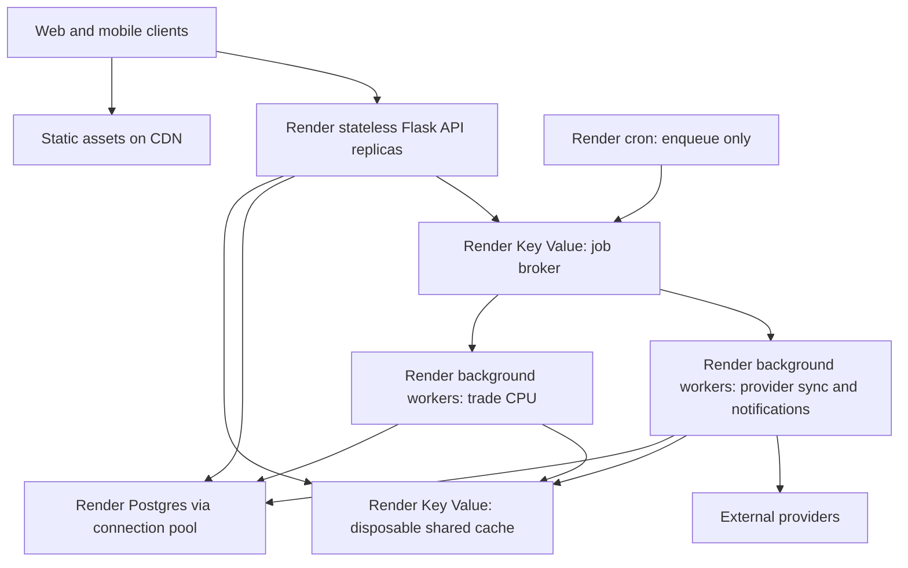

# Scalability review and path to 10,000 concurrent users

Date: September 4, 2026. Status: first prerequisite merged and deployed; [PR #277](https://github.com/mattmurf77/fantasy-trade-finder/pull/277), merged commit `db6b3a17`, is live on the existing Render service.

First implementation milestone: `codex/scoring-execution-context`, based on freshly fetched `origin/main` at `606e512c`. Request scoring selections and accepted trade-job ownership now stay pinned across overlapping requests and session reinitialization. Existing features, generation quality, pregen, and client contracts remain intact. This is in-process groundwork, not a durable worker or permission to increase Gunicorn concurrency. See the [implementation and test record](https://github.com/mattmurf77/fantasy-trade-finder/blob/a3911d2f6aabc9154ab32a2c2b7a8f98091246be/docs/plans/budget-scalability/implementation.md).

Validation: full pre-merge CI passed, **4,629 backend tests passed / one skipped**, including the slow calibration test omitted locally. Mobile typecheck/structural checks, web structure, and test-ID lint also passed. Four read-only production checks passed after deployment; feature flags and tier configuration match the pre-deployment baseline. No additional paid resource or capacity claim follows from this milestone.

Live preflight: the existing Render web service is already on Standard ($25/month), with one instance and one Gunicorn worker; the API returns no autoscaling configuration. The checked-in blueprint's Free setting is stale relative to production. This authorized deployment retains the existing live configuration and adds no paid service. Three existing notification cron services are linked to the same repository. See the [deployment and recovery record](../../recovery/2026-09-04-scoring-context-deployment.md) for exact SHAs, CI, smoke checks, and release status.

## Implementation constraint: preserve functionality

The user authorized an Astra subagent to begin implementation only where functionality is preserved. The active first milestone is request/job context isolation, a prerequisite to separate trade workers. Preserve features, trade search breadth/results, existing pre-generation, API contracts, and supported clients. Regression evidence is required; this is not a guarantee that untested changes cannot cause regressions.

The budget proposals below for search quotas/cooldowns, skipped pre-generation, longer queues, and reduced-service budget shutoffs have user-experience costs. They are **not authorized for this build**. Leave them as explicit future tradeoffs rather than silently enabling them. A strict $200 cap and unlimited heavy demand cannot both be guaranteed by infrastructure refactoring alone. The user subsequently authorized deploying the completed milestone to the existing Render service; this adds no paid resources.

## Budget revision: $200/month maximum — current recommendation

The user's $200 monthly ceiling supersedes the fleet sizing and $1,000–$3,000 allowance later in this document. The original findings still apply; the larger architecture is a deferred growth reference, not the recommended purchase. No paid services have been provisioned.

**Build for bounded work and low operating cost first.** Keep Render and the existing algorithm. Start with one API instance and one separate trade worker, then add at most one of each when measurements justify it. Preserve the same shared-state interfaces so this work remains useful if traffic eventually supports a larger budget.

### Verified component budget

Prices checked September 4, 2026 on the rendered [official pricing page](https://render.com/pricing). These are monthly USD list prices; storage/cron entries below are allowances rather than fixed-price packages. Render renamed compute plans in August 2026; Standard web/worker is now `1c-2g` and Basic-1gb Postgres is `0.5c-1g` ([plan mapping](https://render.com/docs/compute-plans)).

| Component | Start | Expanded within budget |
|---|---:|---:|
| API, 1 CPU / 2 GB per instance | 1 × $25 = $25 | 2 × $25 = $50 |
| Trade worker, 1 CPU / 2 GB per instance | 1 × $25 = $25 | 2 × $25 = $50 |
| Postgres, 0.5 CPU / 1 GB | $19 | $19 |
| Key Value broker, 256 MB, persistence + noeviction | $10 | $10 |
| Separate disposable shared cache, 256 MB | $10 | $10 |
| Database storage allowance | $3 | $3 |
| Three short enqueue-only cron services allowance | $3 | $3 |
| Hobby workspace | $0 | $0 |
| **Base estimate** | **$95** | **$145** |
| **Remaining before the $200 ceiling** | **$105** | **$55** |

Cron services have a [$1/month minimum each](https://render.com/docs/cronjobs), with extra execution time potentially increasing cost. Database storage is $0.30/GB-month beyond included storage. Verify actual database size and recurring services before implementing this budget. All services must use same-region private URLs where possible. Keep fixed instance counts; autoscaling and a Pro workspace are unnecessary for this first budgeted deployment.

The expanded layout is optional. If the DB rather than the API is saturated, spend the spare $25 on upgrading Postgres from $19 to $40 instead of adding a second API. If worker startup exceeds 2 GB, revisit this layout before purchasing; the estimates assume the code can fit after removing duplicated session state. Cap and measure the 256 MB cache; do not store entire Python object graphs in it.

### The ceiling needs usage controls

The $145 configuration leaves $55 for bandwidth, taxes, builds, temporary staging, external API usage, and unexpected storage/cron costs. One provisional allocation is $30 for egress and $25 for everything else; reduce base spend if existing bills or taxes consume more. This is an operating budget, **not a guaranteed provider-enforced invoice cap**.

Hobby includes 5 GB/month, then charges $0.15/GB. Thus a $30 bandwidth allowance buys about 205 GB total/month. Static-site traffic also counts: Render's CDN saves origin CPU, not necessarily the bandwidth charge. At an illustrative 1,000 responses/s averaging 10 KB on the wire, egress is 36 GB/hour, about $5.40/hour once the included allowance is used. Sustaining that for 30 days would cost about $3,887 in egress alone. A brief event and a month of sustained concurrency have very different economics. See [workspace pricing](https://render.com/docs/new-workspace-plans) and [billed bandwidth](https://render.com/docs/outbound-bandwidth).

Track projected monthly cost and bytes, set build spending limits where supported, and implement conservative usage thresholds with enough margin for billing lag. Pause speculative generation first, limit new expensive work next, and provide an explicit reduced-service mode when the budget is exhausted. A hard maximum can require temporarily restricting access; an alert alone does not enforce it. No restriction has been enabled by this review. Do not assume Render's build spending limit covers total bandwidth or the whole invoice.

### Changes to make first

1. **Remove wasted computation.** Unify generation admission across explicit searches, mobile pre-generation, and the backend's automatic session-init kickoff (`backend/server.py:15303`). Turning off only mobile pre-generation is insufficient. Reuse fresh results with correct user/league/format/version keys; skip speculative generation when busy. Start with one active CPU job per worker, a bounded waiting queue, one in-flight job per user, and measured retry/cooldown limits. Update clients to display queued status honestly.
2. **Extract one durable worker.** Pass immutable user/league/format/snapshot inputs rather than local session objects. Persist accepted job intent, progress, ownership, and results; use bounded retries and idempotent effects. Move existing cron work to background execution without buying a dedicated notification fleet. Time-limit I/O work and reserve interactive capacity.
3. **Make API state safe to share.** Preserve verified/unverified session rules, stop request-specific format mutations of shared objects, and load league/ranking state from shared repositories. Only then enable measured HTTP concurrency or add the second API. This correctness work remains mandatory even with a small budget.
4. **Cut request and response volume.** Return compact status/version/counts and incremental or final cards. Add web polling backoff/jitter and stop polling when hidden; retain mobile's protections. Compress payloads, avoid repeated full player lists, use long-lived browser caching for fingerprinted assets, and batch writes. Serve public data from cache; keep personalized data access-controlled.
5. **Tune to actual bottlenecks.** Explicit small DB pools and indexed hot queries; limited telemetry retention and sampled operational events. Measure job CPU-seconds and memory before changing algorithm search breadth. Existing trade narratives are template-based (`backend/trade_narrative.py`); separate Anthropic-backed matchup features must have an independent usage cap if enabled.
6. **Certify only what passes.** Test 100, 250, 500, then 1,000 active users on the budgeted layout with realistic request mix, unique contexts, and background work. These are test checkpoints, not promised capacities. Measure cold login separately. Keep normal API p95 below 500 ms and unexpected failures below 0.5%; set a sustainable generation arrival rate from CPU measurements and require stable queue age. Retain overload and restart tests from the original plan.

### What happens to the 10,000-user goal?

- **10,000 registered users:** a reasonable design objective at this budget if active traffic, retained data, and metered usage remain within limits; it is not an account-count guarantee.
- **10,000 mostly reading cached data during a short peak:** potentially approachable only with aggressive demand reduction and successful load testing. Private personalized requests still reach the API, and Render egress still costs money.
- **10,000 simultaneously interacting at the original 1,000–2,000 API requests/s model:** not a support promise this plan can make within $200, particularly if sustained.
- **10,000 fresh searches together:** requires waiting, admission limits, and/or a substantially cheaper measured algorithm. For illustration, two 1-CPU workers at 65% utilization and two CPU-seconds/job deliver about 0.65 jobs/s. Ten thousand uncached jobs would take over four hours to drain with no new arrivals. Queues preserve responsiveness; they do not manufacture CPU capacity.

The next milestone is a **measured, stable $95 deployment**, followed by spending the remaining budget on the demonstrated bottleneck. The starting layout accepts API/worker outages during instance failures; it is not a high-availability deployment. Test two-process correctness locally or in temporary staging without requiring two production replicas immediately. The 10,000-user target remains a long-term validation target, while the monthly ceiling controls how much work the app admits.

## Recommendation

Keep Render, Flask, and Postgres. Separate HTTP handling from trade computation, remove process-local authoritative state, and measure capacity before selecting final instance counts. A framework rewrite or Kubernetes migration is not a prerequisite.

The checked-in deployment is appropriate for a small beta, not 10,000 active users. Use **20–50 simultaneously active users as a conservative provisional operating envelope**; 50–100 light, warm-cache users might be possible. These are assumption-based planning estimates, not tested maxima or reliability guarantees. Heavy generation or a cold-login burst can overwhelm it at much lower counts.

There is no defensible registered-account maximum from source code alone. Ten thousand registered accounts, ten thousand open but idle apps, and ten thousand people actively generating trades are very different workloads. Storage growth and retained per-session objects also matter, even when requests are sparse.

## Scope and evidence limits

Reviewed the local deployment blueprint, startup, SQLAlchemy setup, session restoration, trade generation and status paths, provider access, scheduled tasks, observability, and web/mobile polling. Checked current official Render documentation. No production load test, production query analysis, or production memory profiling was performed. The subsequent deployment preflight inspected the live Render API and confirmed Standard/one instance/one Gunicorn worker, overriding the blueprint's Free setting. Existing unrelated working-tree changes were left alone.

## Findings, in priority order

| Priority | Evidence in the current code | Impact |
|---|---|---|
| Critical | `render.yaml:14–16`: free web plan; Gunicorn `--workers 1 --timeout 120`, no thread/worker-class setting | With the normal sync worker default, one HTTP request is served at a time. A slow provider request or cron route queues unrelated users. A 120-second timeout does not create capacity. |
| Critical | `backend/server.py:2017`, `:2158`, `:2263`: `_sessions` stores league/player/service objects; durable restoration rebuilds identity but Sleeper league routes need initialization again | Multiple processes/instances cannot reliably share initialized league context. `auth.persistent_sessions` is enabled in the checked-in flags, but persisted identity alone does not solve this. |
| Critical | `backend/server.py:2048`, `:4653`, `:5289`, `:10082`: jobs and their lookup index are local dicts; each kickoff starts a daemon thread that resolves a local session | Another instance cannot serve that job's status. Deploys lose jobs. There is no fleet-wide bounded job queue here; bursts create competing threads. CPU-heavy Python work competes with HTTP handling in the same process. |
| High | `backend/server.py:2263`: request format selection mutates shared session service aliases and `_effective_format` | Merely enabling HTTP threads introduces cross-request format races; job threads already share these objects. Make request context immutable before increasing concurrency. |
| High | `backend/database.py:69`, `:123`: product engine has implicit pool settings; separate report engine has pool size 2 plus overflow 1. Blueprint DB is `basic-256mb` | Every process multiplies connections and memory demand. The report engine still points at the same database; it is not a read replica. More app instances can overload the database. |
| High | `backend/server.py:16357` and other cron handlers do the work inside HTTP requests; import starts `_cleanup_loop` at `:2549`; `:412` calls `init_db()` | Scheduled work blocks the sole HTTP worker. More processes duplicate cleanup/startup work and can race schema changes. `build.sh` also imports the server to bake player data. |
| High | `backend/server.py:531` uses blocking provider HTTP calls; player refresh and other caches/locks are process-local | Provider latency, duplicate refreshes, and upstream request quotas become bottlenecks independent of Render CPU. Existing cache work helps but must be coordinated across the fleet. |
| Medium | `backend/server.py:2704` includes all accumulated cards in status responses. Mobile polling at `mobile/src/screens/TradesScreen.tsx:1340` starts at 800 ms with backoff/jitter up to 4 s; web at `web/js/app.js:3342` uses 1.5 s | Polling can dominate requests and bandwidth. Mobile already has useful backoff; improve payloads and web behavior rather than claiming backoff is absent. |
| Medium | `backend/api_observability.py`: sampled successes and all errors are inserted into `user_events`; Postgres ingestion shares the product engine | Good diagnostic groundwork, but instrumentation and reports consume product database capacity. An error storm increases writes just when the app is struggling. |

Process-local player caches may remain as bounded, disposable read caches. The problem is relying on local memory for correctness, not the mere presence of caching. Similarly, PostgreSQL is already configured for production; a SQLite-to-Postgres migration is not the principal task.

## Capacity model

For the current single sync worker, assume average HTTP occupancy of 100–250 ms under a representative workload. The theoretical ceiling is then 4–10 requests/second. Reserving 40% headroom gives roughly 2.4–6 requests/second. At one request per active user every ten seconds, that corresponds to 24–60 active users. This explains the provisional 20–50 range; the timings are illustrative assumptions, not measurements. Multi-request screens, generation CPU contention, and slow login calls reduce it further.

Define the target as 10,000 authenticated users active in the same time window, with explicit pacing:

| Scenario | Assumed demand | Infrastructure implication |
|---|---|---|
| Normal interaction | One aggregate API request/user/10 s | 1,000 requests/s before any separately modeled polling |
| Busy interaction | One aggregate API request/user/5 s | 2,000 requests/s before separately modeled polling |
| 1,000 people waiting on jobs | One status request/2 s | Additional 500 requests/s |
| All 10,000 waiting | One status request/2 s | Additional 5,000 requests/s; needs a separate stress test |
| 10,000 unique cold generations submitted over one minute | 167 jobs/s | CPU and queue latency, rather than HTTP connections, dominate |

Do not double-count polling if it is already included in measured per-user API rates. Build the real mix from observed sessions, including rankings, swipes, matches, login, events, and provider syncs.

Worker sizing: `required cores ≈ new uncached jobs/second × measured CPU-seconds/job ÷ target utilization`. At an illustrative two CPU-seconds/job and 65% utilization, 10 jobs/s needs approximately 31 cores; 167 jobs/s needs approximately 514 cores. Neither two seconds nor those arrival rates are measured app behavior. This sensitivity makes generation admission control, reuse, and profiling essential. Ten thousand concurrent users can be practical while ten thousand simultaneous fresh computations with short deadlines is a substantially larger project.

## Proposed Render architecture

Use paid Key Value for the broker with persistence and `noeviction`; use a separate cache instance with an eviction policy. A cache flush must not erase accepted jobs or authentication truth. Store durable job intent/results in Postgres and use an outbox/reconciler to recover missed delivery; broker persistence alone is not an exactly-once guarantee. Render documents both [Key Value policies](https://render.com/docs/key-value) and [background workers](https://render.com/docs/background-workers).

API and worker replicas should have no attached persistent disks. Keep services in one region using private connections. Render supports replicated services and CPU/memory autoscaling on Pro workspaces or above, but attached disks prevent horizontal scaling. CPU/memory scaling is not a queue-age SLO: monitor queue age explicitly and pre-scale ahead of predictable peaks. See [Render scaling](https://render.com/docs/scaling).

## Implementation sequence and acceptance gates

### 1. Establish the baseline and stop unbounded work — approximately 3–5 engineering days

- Confirm live web/DB plans, command overrides, database connections, memory, traffic, and latency distributions. Inventory process-local mutable state across services, not just the dicts identified here.
- Add low-overhead request duration, queue wait, job CPU/wall time, RSS, cache-hit, provider-call, and DB-pool-wait metrics. Preserve existing diagnostic sampling; avoid a product DB write for every new metric.
- Create a separate Render staging environment with PostgreSQL and synthetic league/user data. Use recorded provider fixtures for high-volume tests; validate a small controlled live-provider sample separately.
- Add bounded trade admission, per-user in-flight limits, deduplication, and explicit busy/retry responses. Prevent automatic pre-generation from consuming all interactive capacity.
- Move the web service to a paid plan for a stable baseline. Keep one process until the cross-process gate below passes; do not promise large capacity from this temporary upgrade.

Gate: repeatable throughput/latency curves and measured CPU/RSS per job/session, plus bounded overload behavior. Publish observed limits rather than replacing guesses with new guesses.

### 2. Make request handling independent of the process — approximately 1–2 weeks

- Introduce an identity/session repository and a league-context repository. Preserve verified/unverified/demo lifetimes and authorization; do not extend unverified persistence as a side effect.
- Persist compact references and versioned league/roster/ranking snapshots. Construct service objects from this data. Do not pickle the entire session object graph into Redis.
- Pass user, league, scoring format, and snapshot versions explicitly through request and job contexts. Remove request mutations of shared service aliases.
- Make rankings/preferences/deck changes invalidate shared versions. Keep tiny bounded process caches keyed by version, with controlled rebuilds.
- Move schema migrations to a single deployment step, stop migration/cleanup work at import, and make player-cache baking a standalone command. Separate readiness from liveness.

Gate: alternating requests across two processes and then two Render instances preserves login, league initialization, format choice, decks, swipes, and authorization. Restart either instance during the test. No stickiness dependency, unexpected 401/409, missing job/deck state, or cross-user leakage.

### 3. Extract durable jobs and scheduled work — approximately 1–2 weeks

- Introduce a queue abstraction; evaluate a conventional Python queue such as Celery with a Redis-compatible broker against the required retry/lease behavior before pinning dependencies.
- Convert `_run_trade_job` to accept immutable IDs/options/snapshot versions, not a session token pointing to local objects. Keep the existing trade algorithm initially.
- Persist job ownership and lifecycle: queued, running, complete, failed, expired. Include leases/heartbeats, bounded retries, idempotent writes, abandoned-job recovery, and dead-letter inspection. A timeout must stop/reap execution, not merely relabel an active thread.
- Deduplicate atomically using user, league, format, rankings/roster versions, fairness, pins, opponent, intent, and relevant preference/engine versions. Existing cache semantics need explicit preservation and audit.
- Isolate CPU trade work from provider/notification I/O and low-priority pre-generation. Use process-based CPU execution with limits derived from CPU and memory measurements.
- Make cron enqueue bounded batches. Use database uniqueness/idempotency for repeated scheduling and notification dispatch; retries must not duplicate effects.
- Support queued jobs in web and mobile without the old roughly minute-long abandonment assumption. Keep old clients compatible through additive responses or an API version transition.

Gate: terminate workers mid-job, redeliver messages, restart the broker, and deploy with jobs in flight. Accepted work either completes once in its durable effects or reaches an explicit recoverable failure. Interactive API latency stays within budget while workers are saturated.

### 4. Reduce demand and bound database usage — approximately 1–2 weeks, partly overlapping phase 3

- Add shared provider-response caching, per-key refresh deduplication, freshness windows, stale-while-refresh where appropriate, pooled outbound connections, deadlines, and provider-wide concurrency/rate budgets. Validate each provider's actual allowed usage; never assume more API replicas permit more upstream traffic.
- Return compact status/version/count fields and fetch cards once or by a cursor for incremental progress. Add jitter/backoff and visibility-aware polling to web; retain mobile's existing protections. Have the server recommend polling cadence. Consider SSE only if polling measurements justify the added connection-management work.
- Serve web assets through a CDN/static site with fingerprinted filenames; preserve dynamic share/profile routes. Cache public ranking/value payloads using explicit data versions and ETags. Never publicly cache personalized responses. Test cross-origin configuration if assets/app/API use separate origins.
- Set explicit SQLAlchemy pool/overflow/timeouts for every process, including workers and reports. Add pool health handling. Enable Render's [integrated PgBouncer](https://render.com/docs/postgresql-connection-pooling) where appropriate and test transaction-pooling compatibility, including read-only and statement-timeout setup. Keep migrations on a direct connection if needed.
- Budget connections at maximum autoscale, including deployment overlap: `sum(processes × (pool_size + max_overflow))`, plus reports, jobs, and administration. Pooling does not increase query CPU capacity.
- Profile hot SQL with representative row counts and query plans; eliminate confirmed N+1 patterns and add measured composite indexes. Batch analytics, cap retention, and move operational telemetry off the product write path. Add rollups before considering a replica or separate analytics store.

Gate: cache stampedes, expired sessions, provider outages, and analytics bursts do not exhaust the API/DB. Query and connection budgets hold at the configured maximum replica count.

### 5. Size and certify the deployment — approximately 1 week after prior gates

Initial staging candidate, not a capacity guarantee: 2 API replicas, each around 2 vCPU/4 GB; 2 CPU worker replicas of similar size; separate bounded I/O workers; Postgres around 2–4 vCPU/8–16 GB; separate paid broker and cache. Size cache memory from measured serialized bytes and retention. Benchmark process/thread counts rather than applying a generic worker formula.

Test API scaling through 2, 4, and 8 replicas. As an illustration, if one replica sustains 250 requests/s within the target latency, 1,500 requests/s needs six replicas just to carry traffic, and roughly eight to retain 25% spare capacity. If measured throughput is lower, recalculate. Size workers independently using the job formula above.

Run staged load at 100, 500, 1,000, 2,500, 5,000, and 10,000 distinct users. Use an arrival-rate-driven test as well as interactive virtual users so a slowing server does not silently reduce offered traffic. Seed realistic historical data and unique personalized contexts, not one account hitting a universal cache.

Proposed release gates, to confirm as product requirements:

- Warm interactive reads and writes: p95 under 500 ms, p99 under 1.5 s.
- Job acknowledgement: p95 under 300 ms. At the agreed normal generation rate: queue wait p95 under 2 s, first useful cards p95 under 5 s, full generation p95 under 20 s. Validate or revise based on the algorithm baseline; these are goals, not current measurements.
- Unexpected HTTP 5xx/timeouts below 0.5%; record rejected/429 traffic separately so shedding cannot masquerade as success.
- No state-loss, duplicate durable effects, or authorization failures when a replica dies or a rolling deploy occurs.
- At least 25–30% capacity headroom; stable queue age, DB pool wait, and memory during a two-hour 10,000-user soak, followed by a longer endurance run.
- Separate cold-login, cache-flush, 2× traffic-burst, all-users-polling, and heavy-generation tests. Report achievable latency and rejection rates for overload rather than promising the same SLO for unlimited compute demand.

Roll out by a small user cohort, then 10%, 50%, and 100%, with compatible schema/API changes and a rollback switch. Keep old workers/protocol readers available until old jobs drain. Pre-scale for known peaks; do not depend on reactive autoscaling to absorb an instantaneous event.

## Original growth budget and delivery expectation — deferred

Allow roughly **5–8 engineering weeks** for implementation, validation, and staged rollout by an engineer familiar with this code; discovery may change that estimate. The highest uncertainty is extracting mutable session-bound service behavior and profiling the generation algorithm, not writing `render.yaml`.

Do not buy the full target fleet before the baseline. Treat **$1,000–$3,000/month as an initial budgeting allowance**, not a Render quote or an assertion that this buys the target capacity. Sustained compute-heavy generation, high egress, HA, telemetry, backups, and third-party usage can push costs materially higher. Build the actual estimate from measured API replicas, measured worker CPU demand, DB/cache sizes, peak duration, workspace fees, and bandwidth using [current Render pricing](https://render.com/pricing). Pricing tables were not fully exposed by the retrieved page, so no exact SKU prices are asserted here.

The first implementation milestone should be **two replicas passing the same user journey reliably**, followed by isolated job execution. Once those gates pass, Render instance sizing becomes an evidence-based capacity exercise instead of a correctness risk.
