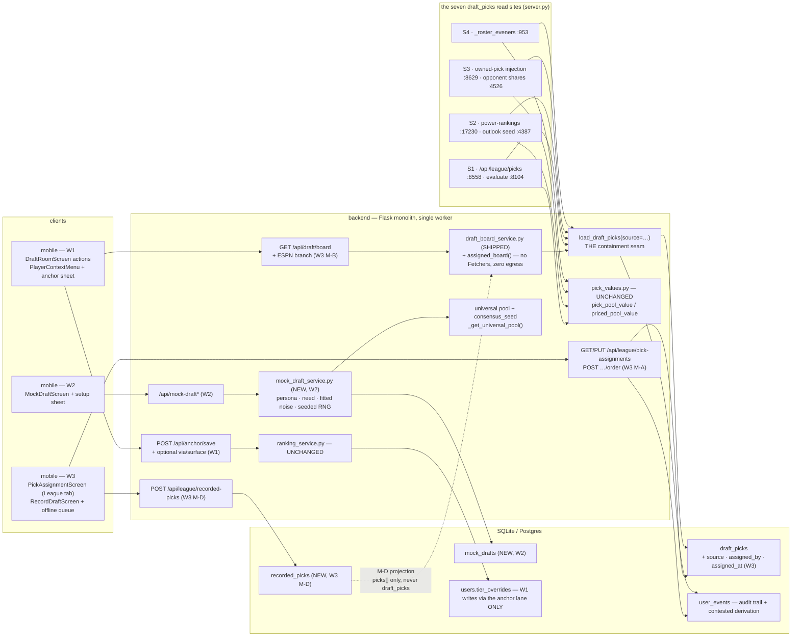

# HLD — Draft-Surface Extensions (W1 draft-room actions · W2 FTF-native mock · W3 ESPN pick assignment)

**Date:** 2026-08-06 · **Status:** Draft for build briefing
**Parent (normative):** [plan.md](plan.md) — **FINAL and BINDING**, including the *"Operator decisions — ESPN pick assignment (2026-08-06)"* block at the bottom and every §6 subsection. Every decision in it is settled; nothing here re-opens one. D0–D18, W0–W3, M-A–M-D, S1–S4, O1–O6, O-D1–O-D5 references resolve to that document.
**Also normative, inherited:** [../rookie-draft/plan.md](../rookie-draft/plan.md) (parent feature, incl. its two operator-decision blocks) · [../rookie-draft/hld.md](../rookie-draft/hld.md) · [../rookie-draft/lld.md](../rookie-draft/lld.md) · [../rookie-draft/mock-draft-plan.md](../rookie-draft/mock-draft-plan.md) (W2's spec, tracked at `dc32c2a`) · [../rookie-draft/build-placement.md](../rookie-draft/build-placement.md).
**Grounding:** code read on `origin/main` @ `20c2a54`. Every `file:line` below was opened, not inferred. Claims the plan verified against live endpoints, and claims no local artifact can confirm, are marked **ASSUMPTION**.
**Method:** every component states failure mode → degradation → blast-radius bound, per the parent HLD. **A degradation that produces no counter is a spec bug** — §5.1's ladder names a counter for every rung.

---

## 1. Context & Goals

### 1.1 Stance

Three waves that share one substrate — the shipped Draft Room — and almost nothing else:

- **W1** adds *actions* to a surface that today is entirely inert: undrafted rows are non-interactive and the screen emits zero analytics. It buys one already-shipped write lane (`POST /api/anchor/save`) and forbids the other (`save_tiers_position` / the merged-band path).
- **W2** builds an FTF-native mock draft — the only wave that is genuinely new software rather than a composition of shipped parts. It is also the only wave with a *statistical* acceptance bar (a fitted noise model with a held-out split) rather than a behavioral one.
- **W3** is the hard one. It reverses a documented invariant — `draft_picks.platform`'s "ESPN never writes rows" (`backend/database.py:737`) — and lets a *user* write the store the trade engine prices from, at seven read sites, league-shared, with **full engine parity per operator decision 4**. Every safety property in this design exists to bound that one reversal.

The design goals are the host's constraints, not the features' ambitions:

- **G-A (a writer only ever deletes rows it could have written).** `replace_draft_picks` (`backend/database.py:7447-7465`) is an unconditional `DELETE … WHERE league_id = ?` followed by a chunked insert. It is scoped to the league and to *nothing else* — not season, not platform, not owner. Two writers into one league today means the second erases the first. W3 introduces a second writer, so provenance-scoped deletion is a **precondition**, not a hardening pass.
- **G-B (containment is the default, not a review step).** `load_draft_picks` (`backend/database.py:7468-7489`) has seven production call sites and no filter beyond `league_id`/`owner_user_id`. If asserted rows simply appear in that table, all seven light up at once with no gate. The default must be platform-only and the opt-in must be individually greppable, testable and revertible — which is also what makes the S1→S4 build order verifiable (operator decision 4).
- **G-C (value can be redistributed, never created).** Because price is a pure server-side function of the pick's coordinates and every owner must be an existing member inside a fixed `rounds × teams × seasons` grid, the total asserted pick value in a league is bounded by an equivalent Sleeper league's. The only inflation lever is `rounds`, which is why the clamp is enforced server-side (§6.2 + operator decision 2).
- **G-D (provenance is inescapable, and it is a hole, not a whisper).** A contested slot is dropped from the priced union entirely — a visible hole beats invisible churn (§6.3). Every priced surface carries the label and a one-action correction (D17).
- **G-E (flag-off is byte-identical).** Five new flags, all landing OFF, all 4-touch. With every flag off the same build serves byte-identical responses on all seven read sites plus board/picks/evaluate/power-rankings, `schema` stays `1`, and **no closed client enum gains a member** (D10).

### 1.2 Constraints from the real codebase (verified)

| Fact | Where | Consequence |
|---|---|---|
| `replace_draft_picks`'s DELETE is scoped to `league_id` **only** | `backend/database.py:7456-7461` | W3 must add provenance scoping before any second writer exists (G-A) |
| `draft_picks`' only UNIQUE is `pick_id` alone; **no user dimension** | `backend/database.py:739` (`uq_draft_pick_id`) | Correct under the operator's league-shared model: one row per slot *is* the truth. It is why per-user isolation is impossible without a schema change nobody asked for |
| `pick_id = f"{league}_{season}_{round}_{original_roster}"`, built by **three** duplicated f-strings | `backend/database.py:7369`, `:7404`, `backend/server.py:8823` | The assignment seeder is a fourth. Round is unpadded, so `pick_id` is **not** lexicographically sortable |
| `load_draft_picks` has exactly **seven** production call sites, all in `server.py` | `:953`, `:4387`, `:4526`, `:8104`, `:8558`, `:8629`, `:17230` | The plan's seven line numbers are undrifted. §3.2 maps each to its stage |
| Only **two** of the seven price through `priced_pool_value` | `backend/server.py:8105-8106` (evaluate) and `:8633-8634` (`_owned_pick_assets`). `_roster_eveners:955` and `_power_picks_by_owner:17241` read the stored `pool_value` directly | The M6b per-user pricing mode is not universal. D13's byte-equality bar must name `priced_pool_value`, not `pick_pool_value` — see §6, RB-1 |
| `_power_picks_by_owner` **re-derives** a price when `pool_value IS NULL` | `backend/server.py:17241-17244` | "Unprice a contested pick by nulling `pool_value`" would silently re-price it here. Contested exclusion must be **row filtering**, never value nulling |
| `picks_supported` is a display label, computed once and emitted twice | `backend/server.py:8553-8554`, emitted `:8556` + `:8564` | Turning it into a data test is a two-line change inside one function |
| The two ESPN "engine guards" are duplicated **three-clause** literals, not `picks_supported` | `backend/server.py:4570-4572` (`_run_trade_job`) and `:9309-9311` (`asset_trade_ideas`) | The `_owned_picks_available()` helper must preserve **all three** conjuncts (`FLAGS.trade_picks_in_pool`, platform, `league_id != "league_demo"`), not just the platform test |
| `build_board` returns `platform_unsupported` for anything outside `(sleeper, mfl)` | `backend/draft_board_service.py:340-342`; the route's own fallback at `backend/server.py:10201-10202` | The ESPN room is a **route-level** branch, so `build_board` stays byte-identical with the flag off |
| `notice` is an open `{code, message}` object with a message table; `state`/`kind`/`order_confidence` are closed enums | `backend/draft_board_service.py:101-118`, `:76-94`, `_notice()` `:1203-1206` | `picks_not_assigned` rides `notice.code` exactly as D10 requires |
| The mobile client's `notice` fallback is **real**: the if-else chain ends in `(board.notice?.message ?? '')` and renders nothing when empty | `mobile/src/screens/DraftRoomScreen.tsx:387-404` | An old binary receiving `picks_not_assigned` renders the **server's** message string — degradation is graceful, not blank. `NoticeCode` is a closed **TypeScript** union (`mobile/src/api/draft.ts:28-33`), so the new client extends it; that is a compile-time change, not a D10 closed-enum member (D10 names `state`/`kind`/`order_confidence`) |
| `STATE_LABEL` has **no** runtime fallback — an unknown `state` renders `undefined` | `mobile/src/screens/DraftRoomScreen.tsx:280-285` | Independent confirmation that `state` must not gain a member. `DEGRADED_COPY` *does* fall back (`:320`) |
| **There is no anchor *sheet*.** `saveAnchor` has exactly one caller — the full-screen `PickAnchorScreen` | `mobile/src/api/rankings.ts:378-384`; caller `mobile/src/screens/PickAnchorScreen.tsx:202-204`, buttons `:360`, grid constant `ANCHOR_ROWS` `:39-52` | W1's "Set my value" must **build** a sheet that reuses the shipped lane and the shipped rung grid. The plan's phrase "the anchor sheet" names a component that does not exist — see §6, RB-11 |
| **There is no "⋯" affordance anywhere in the app.** The shipped vocabulary is long-press + an a11y custom action | `mobile/src/components/TradeCard.tsx:290-294` (`longPressFor`), `:304` + `:329` (`accessibilityActions` `{name:'menu', label:'Player options'}`) | The plan's "explicit '⋯' affordance for accessibility" is net-new to the design system. The shipped a11y answer is the custom action, which already solves the stated accessibility problem — see §6, RB-12 |
| The write gate is `@_gate_unverified_write`; the read gate is `@_gate_unverified_read`; the acting user id is **always** `sess["user_id"]` and a body `user_id` is ignored | `backend/server.py:2255-2271`, `:2317-2340`; the teardown S6B-01 precedent at `:11522-11532` | Every W3 write route carries the write gate and resolves the actor from the session, never from the body |
| `POST /api/anchor/save` reads **exactly two** body fields and emits `anchor_answered` with three props | `backend/server.py:7192-7194` (route + write gate), body parse `:7211-7218`, event `:7273-7285` (`props={player_id, pick_value, skipped}`) | W1's `via`/`surface` is greenfield on this route and lands in those props |
| The TIERS-SAVE `via` whitelist **already carries the `rookie_*` members** and falls back to `"tiers"` | `backend/server.py:7140-7143` (the plan's `:7141` is the whitelist tuple's first line) | Confirms it is the M2 lane. **W1 must not touch it** |
| `FLAG_KEYS` is a tuple; `DEFAULT_FLAGS = {key: False for key in FLAG_KEYS}` | `backend/feature_flags.py:47-418`, `:420` | No flag can ship default-true from Python. Mirror enforced by `backend/tests/test_seed_ui_test_db.py:105-111` + `backend/tests/test_entitlements.py:88-98` |
| The AST-containment precedent is `test_m3_07`, with a stronger docstring-identity-exclusion sibling | `backend/tests/test_draft_board.py:398-412` (`_imported_names` helper `:387-395`); the identity-exclusion variant `:258-287` | D12's test copies this shape, not a grep |
| Additive columns are a 3-tuple appended to `migration_cols`, one `ALTER` per transaction, try/except-swallowed, **no** `DEFAULT`, **no** `NOT NULL` | `backend/database.py:1744-1848` (list), `:1852-1857` (executor); `pool_value`/`platform` precedent at `:1828-1830` | The three W3 columns land here. Every additive column is nullable with NULL backfill; semantics live in Python |
| New tables are declared as `Table(...)` on `metadata`; `create_all` covers fresh DBs, and any index on a **pre-existing** table needs explicit `CREATE INDEX IF NOT EXISTS` in `_migrate_db` | `backend/database.py:1962-1975` (precedent) | `recorded_picks` is new, so `create_all` suffices; the `draft_picks` provenance index does **not** and needs the explicit form |
| The soft-delete precedent is a nullable ISO `String`, `IS NULL` = live, set-once | `deck_suppressions.lifted_at` `backend/database.py:539`, read `.is_(None)` at `:4485`, `:4520`, `:4562` | `recorded_picks.voided_at` copies it verbatim |
| `league_members` has **no** `roster_id` column | `backend/database.py:304-313` | `draft_picks.original_roster_id` is **not joinable** to `league_members`. The only bridge is `owner_user_id`/`original_user_id` → `league_members.user_id`. The assignment grid must be keyed on *user ids*, with roster ids as opaque slot labels |
| The analytics taxonomy is **default-deny** and asserts client/server namespace disjointness at import | `backend/analytics_taxonomy.py:38` (`ALLOWED_CLIENT_EVENTS`), `:86` (`SERVER_FIRED_EVENTS`), `:128` (`CLIENT_EVENT_PROPS`), `:216` (assert) | W1's new client events need **two** registry entries each or they are counted-and-dropped. W3's `pick_assignment_changed` is server-fired |
| `anchor_answered` is already **server-fired** | `backend/analytics_taxonomy.py` `SERVER_FIRED_EVENTS` | W1's `via`/`surface` rides `record_event(props=…)` server-side — no client allowlist change, and no response-shape change (D10 is about responses) |
| `/api/sleeper/leagues/<user_id>` = Sleeper's own list + `load_local_leagues_for_user`, which filters to **non-numeric** ids | `backend/server.py:12236`, `backend/database.py:5724-5734` | ESPN leagues (numeric platform-native ids) are structurally absent from that route. This is P-1's root cause and P-2's third guard |
| `ranks.rookie_subset` and `draft.room` are **already `true`** in `config/features.json`; `picks.owned_sync` and `trade.picks_in_pool` are `true`; `trade.slot_pricing` is `false` | `config/features.json:48`, `:52`, `:145-146`, `:149` | W1/W2/W3's own flags are the only new dark surface. The Draft Room is live |
| Backend suite baseline | `python3 -m pytest backend/tests -q --collect-only` → **1764 collected** on `20c2a54` | Every wave states its exit count against this |

**Simplest design that satisfies the plan:** three additive columns and one new table; **one** new backend module (`mock_draft_service.py`); one new render function inside the shipped `draft_board_service.py`; one new mobile screen per wave that needs one; **zero** new cron jobs, deployables, datastores, queues or brokers; and **zero** platform writes anywhere. Everything else is rejected in §4.

---

## 2. Architecture Overview

### 2.1 Component map



**Deliberately absent:** no per-user pick store · no board-grid table (the grid *is* `draft_picks`) · no contested column (contested is derived from `user_events`) · no approval/commissioner role · no ESPN adapter, `espn_verdict()`, `draft.espn` flag or ESPN polling (operator ruling: ESPN has no rookie drafts, so there is no platform draft object to read — ever) · no supersede machinery (D4 is retired from W3 for the same reason) · no `overall` column on `draft_picks` · no user-entered values anywhere. Each absence is a stated failure mode chosen over a maintenance mode.

### 2.2 Components: responsibility → failure envelope

| Component | Responsibility (owns) | Failure mode → degradation → blast-radius bound |
|---|---|---|
| **W1 — draft-room actions** (`DraftRoomScreen` + `PlayerContextMenu`) | Long-press (plus the explicit affordance the plan requires — see RB-12) on an undrafted row opens the **shipped** `PlayerContextMenu` (`mobile/src/components/PlayerContextMenu.tsx:33-52`, flag `ux.player_context_menu` already `true`): *Set my value* → a **new** anchor sheet reusing the shipped `saveAnchor` lane and `PickAnchorScreen`'s `ANCHOR_ROWS` grid → `POST /api/anchor/save`; *Rank the rookies* (the existing jump at `DraftRoomScreen.tsx:181-185`, now with a return route); *Add to targets* (the shipped per-user-per-league asset-pref write). Optimistic re-price + query invalidation. Per-player testIDs `draft-room.undrafted-row.<pid>` — today's rows share one non-unique testID (`DraftRoomScreen.tsx:596`), which is why the flow is untestable. | A failed anchor save rolls the optimistic re-price back and toasts; nothing is written. **Bound:** the anchor lane only — no new surface may reach `save_tiers_position` or the merged-band path, which is the one construction that can destroy a board (parent HLD RB-1). `tiers_saved`/`all_done` are provably untouched (D1). Flag `draft.rank_inline` off ⇒ rows stay inert exactly as today. |
| **W1 — instrumentation** | The Draft Room emits **zero** `track()` calls today. W1 adds the client events plus the optional `via`/`surface` on the anchor route, carried into `anchor_answered`'s server-side props. | A dropped event is invisible data loss, not a user-visible failure — which is precisely why the taxonomy is default-deny (`analytics_taxonomy.py:216`). A new client event without **both** an `ALLOWED_CLIENT_EVENTS` and a `CLIENT_EVENT_PROPS` entry is counted-and-dropped at ingest; a missing props entry raises at **import**. **Bound:** request-only body field ⇒ D10's byte-identical-*response* bar is unaffected. |
| **`mock_draft_service.py`** (NEW, W2) | Pure simulation: turn order (linear/snake + traded-pick ownership), CPU scoring `score(c) = rank(c) − need_bonus − jitter`, persona = `outlook_alpha` parameters, positional-need severity, seeded per-pick RNG, resume from one row. CPU basis is **market consensus** (`_get_universal_pool()` → `consensus_seed`, the same source `BASIS_CONSENSUS` uses), explicitly labeled in-UI, **never** the user's board. | A simulation bug is confined to one `mock_drafts` row: abandon/restart is the escape hatch and no other surface reads the table. **Bound:** zero platform egress after creation (D8, fixture-seam counters); the mock never writes `draft_picks`, `leagues.draft_status*`, or any board state. **W2's abort criterion is structural:** if the fitted noise model fails hold-out validation *inside the calibration batch*, practice/replay ships as a QA-only surface and the CPU-bot mock is **cut**. |
| **`draft_board_service.assigned_board()`** (NEW fn in the shipped module, W3 M-B) | The ESPN room. Builds a `schema:1` payload from the assignment grid alone: order from the grid, `picks: []`, the full rookie class undrafted, `state:"upcoming"`, **zero** platform egress and **zero** cache participation (the DB is the source; there is nothing to fan in). | No assignments ⇒ `state:"unavailable"` + `notice.code = "picks_not_assigned"` + a CTA to M-A. Flag off ⇒ the route's existing `unsupported_board()` path, byte-identical (D15). A DB read failure degrades to that same payload. **Bound:** the branch lives in the **route** (`server.py:10201-10202`), so `build_board` is untouched and its golden diff is unchanged. |
| **Assignment store + projection** (W3 M-A/M-C) | Three additive columns on `draft_picks`; a pristine seeder over `current + 3` seasons × user-set rounds × N teams; per-slot CAS writes; `load_draft_picks(…, source=…)` defaulting to platform-only; contested derivation from `user_events`. | A bad assignment is **wrong until a human fixes it** — ESPN will never contradict it (§6.9.3, accepted). Mitigations are structural: the conservation bound (G-C) makes over-assertion non-inflationary; contested ⇒ unpriced makes disagreement a visible hole; `picks.assign_tradeable` kills trade math **without destroying the entered rows**. **Bound:** provenance-scoped DELETE (G-A) + the D12 AST test mean no path outside the assignment routes can reach `replace_draft_picks`/`sync_draft_picks` for an ESPN league. |
| **Offline recording** (W3 M-D) | `recorded_picks` (append-only, non-destructive undo via `voided_at`), `(league, season, overall)` as the idempotency key, and the AsyncStorage queue contract **copied verbatim** from `mobile/src/api/events.ts` (uuid idempotency, backoff, foreground flush, `{accepted, deduped, rejected}` reconciliation). | Connectivity loss is the *expected* state in a draft room, so the queue is the primary path, not the fallback. A duplicate or lost pick after reconnect is an **idempotency bug with zero tolerance** — recording stays on the allowlist until it is fixed (§6.8). **Bound:** `recorded_picks` projects into the board's `picks[]` only. `overall` is legitimate here and **must never** leak onto a `draft_picks` row (D18) — `draft_picks`' grain has no slot dimension and never will. |

### 2.3 Interactions — sync vs async

Everything on a request path is synchronous. This design adds **no** new asynchrony server-side:

- **W1** — one request per action; optimistic client state, invalidate-on-success.
- **W2** — `advance_cpu` runs the CPU tail inline. Each pick is an argmin over ≤ ~10 candidates; a full 60-pick tail is microseconds on the single worker. No timer, no polling, no `refetchInterval` (so W2 never touches the parent's RV-8 machinery).
- **W3 M-A/M-C** — per-slot `PUT`s, each its own transaction. No batch form, no giant dirty save.
- **W3 M-B** — the ESPN board is a pure DB read, so it is *cheaper* than any Sleeper state and never participates in the TTL cache, breaker or budget.
- **W3 M-D** — the only asynchrony is **on the client**: the AsyncStorage queue drains on foreground and on connectivity, exactly as `events.ts` already does.

---

## 3. Data Model & Flow

### 3.1 Entities

| Entity | Status | Use |
|---|---|---|
| `draft_picks` | Shipped `backend/database.py:723-740` | **W3's store.** Gains `source` / `assigned_by` / `assigned_at`. The grain is already exactly right: one row per `(league, season, round, original_roster)` |
| `draft_picks.pool_value` / `pick_value` | Shipped | Written by the seeder from `pick_pool_value(round, years_out, fmt)` / `compute_pick_value(round, season, current, size)` — **the identical functions Sleeper's sync uses** (`backend/database.py:7385-7386`). No new value logic, ever (D13) |
| `recorded_picks` | **NEW**, W3 M-D | The live offline-draft feed. `UNIQUE(league_id, season, overall)` is the idempotency gate (the `deck_replenish_log` precedent, `backend/database.py:559-575`) |
| `mock_drafts` | **NEW**, W2 | One resumable simulation per user+league. Shape per `mock-draft-plan.md` §4 |
| `user_events` | Shipped `backend/database.py:991-1021` | W3's **audit trail** (`pick_assignment_changed`) *and* the derivation source for the contested set. No new table (§6.3) |
| `users.tier_overrides` | Shipped | W1 writes it **only** through the shipped anchor lane |
| `leagues.draft_status*` | Shipped #207 | **Read-only for all three waves.** O9 survives: nothing here writes a draft-status verdict from user input (D12) |

**Storage decision (W3), restated as design rationale.** The plan resolved the two lenses' split in favor of writing `draft_picks`. The reason is that the alternative is not "a safer store" but "the same store, reimplemented": seven read sites share five pieces of pricing and labelling machinery — `_owned_pick_label` (`backend/server.py:8570`), `pick_pool_value`, `priced_pool_value`, the `inv_pick_value` bridge (`backend/server.py:8646`, a **local variable**, not a function — the plan's `:8655` has drifted by nine lines) and `_pick_asset_elos` (`:8662`) — that a parallel store would have to duplicate or adapter-convert into `draft_picks` shape anyway. MFL is the working precedent: `_sync_mfl_owned_picks` (`backend/server.py:8744-8840`) builds rows outside the Sleeper sync, stamps `platform`, and calls `replace_draft_picks`. The risk lens's objection was written for a per-user isolation model the operator has rejected; under league-shared truth, one row per slot is *correct* and the missing user dimension is a feature.

### 3.2 Flow A — assignment → projection → the seven read sites

```
PickAssignmentScreen (League tab)
  │  1. seed        POST /api/league/pick-assignments/order   → seed_pick_grid()
  │  2. correct     PUT  /api/league/pick-assignments         → per-slot CAS
  ▼
draft_picks rows  { source:'user', assigned_by, assigned_at, pool_value=pick_pool_value(...) }
  │
  ▼
load_draft_picks(league_id, source=…)          ← THE containment seam
  ├─ source='platform' (DEFAULT)  → WHERE source IS NULL OR source='platform'
  │                                  ⇒ byte-identical to today at every un-opted site
  └─ source='any'  (7 opted sites, all behind picks.assign_tradeable)
        └─ minus the contested set, derived from user_events   ⇒ the PRICED UNION
  │
  ▼
S1  /api/league/picks :8558 · /api/trade/evaluate :8104      user sees + prices their own picks
S2  power-rankings :17230 · own outlook seed :4387           draft capital in standings
S3  owned-pick injection :8629 · opponent shares :4526       picks enter GENERATED suggestions
S4  _roster_eveners :953                                     one-tap "add their 2027 1st" sweeteners
```

**Staging is a BUILD SEQUENCE, not a release gate** (operator decision 4). S1 → S2 → S3 → S4 are implemented and golden-diffed **in that order** so each site is verified independently, and then **all four land together** behind `picks.assign_tradeable`. The §6.8 thresholds (adoption, contested rate, offline integrity) survive as **monitoring and rollback triggers**, not ship gates.

**Three properties make the seam safe rather than merely conventional:**

1. **The default is the whole containment.** Every existing row has `source IS NULL`, so `source='platform'` selects exactly today's rows in exactly today's order (`season, round, pick_value DESC`, `backend/database.py:7482-7486`). A site that has not opted in cannot change, and that is provable by golden diff rather than by reading.
2. **Contested ⇒ unpriced is a ROW FILTER.** It must never be implemented by nulling `pool_value`: `_power_picks_by_owner` re-derives a price when `pool_value IS NULL` (`backend/server.py:17241-17244`), so nulling would *silently re-price* the very row the rule exists to withhold. `/api/league/picks` is the one site that asks for contested rows explicitly, and renders them as open questions with no value.
3. **The price is never user-supplied.** `pool_value` on a `source='user'` row is byte-equal to what the shipped function returns for its coordinates. This is what makes G-C provable rather than aspirational.

### 3.3 Flow B — the ESPN Draft Room's three states

All three return the same `schema:1` envelope. `state`, `kind` and `order_confidence` **gain no new members** (D10); the ESPN-specific information rides `notice.code`.

**B1 — flag off (`picks.assign` off).** The route's existing `if platform != dbs.SLEEPER: return jsonify(dbs.unsupported_board(req))` (`backend/server.py:10201-10202`) is unchanged ⇒ `state:"unavailable"`, `notice.code:"platform_unsupported"`, byte-identical to what ships today. Zero DB reads beyond what the route already does.

**B2 — flag on, no assignments.** `state:"unavailable"`, `order:[]`, `picks:[]`, `undrafted:[]`, `undrafted_suppressed:true`, `notice.code:"picks_not_assigned"` with a CTA into M-A. **The operator called this an "error"; it is not.** It is an *unconfigured state with a user-performable fix*, and the copy must read that way — "Nobody has set this league's draft picks yet", not "Something went wrong".

**B3 — flag on, assignments present.** A real `upcoming` board: `order[]` from the grid (slot numbering from the linear/snake toggle — which changes **numbering only, never ownership**), `order_confidence:"assigned"`, `picks: []`, `kind:"rookie"`, and the full rookie class in `undrafted[]` via the shipped `_undrafted()` path. `as_of` is the newest `assigned_at` in the grid. **Zero platform egress in every one of the three states** (D15) — ESPN has no draft object to read, now or ever.

### 3.4 Flow C — live recording → board

```
RecordDraftScreen (cursor auto-advances through the assigned grid)
  tap player → confirm            (~2 gestures; the team is known from the grid,
                                   editable ONLY when the grid was wrong)
  │
  ▼  enqueue { idempotency_uuid, league_id, season, overall, player_id, picking_team_id }
AsyncStorage queue  ── contract copied VERBATIM from mobile/src/api/events.ts ──
  │   foreground flush · backoff · overflow policy · {accepted, deduped, rejected}
  ▼
POST /api/league/recorded-picks     → UNIQUE(league_id, season, overall) absorbs replays
  │
  ▼
recorded_picks (append-only; undo sets voided_at, never DELETE)
  │
  ▼  projection at render time only
assigned_board(): picks[] ← recorded_picks WHERE voided_at IS NULL
                  undrafted[] ← rookie class − recorded − rostered
```

**`overall` is legitimate here and must never leak backwards onto a `draft_picks` row (D18).** `draft_picks`' grain is `(league, season, round, original_roster)`; an `overall` on it would be a slot assertion the conservation bound does not cover and the `pick_id` format cannot express. The projection is one-directional: `recorded_picks` → the board's `picks[]`. It never writes `draft_picks`, never touches `leagues.draft_status*`, and never marks a draft complete.

**Attribution costs zero extra gestures precisely because the grid exists.** This is why M-D sequences after M-A and not beside it: with an assigned grid the app already knows whose pick 1.03 is, so recording stays tap-player → confirm. Without one, every pick would need a team picker, which is the burden argument the risk lens retracted.

### 3.5 Flow D — W1's anchor lane (the forbidden path, stated as a flow)

```
undrafted row  ──long-press / "⋯"──►  PlayerContextMenu
   ├─ "Set my value"   → anchor sheet → saveAnchor → POST /api/anchor/save {…, via|surface}
   │                                       └─► ranking_service.apply_anchor  (ALREADY subset-safe)
   ├─ "Rank the rookies" → Main → Rank → RookieRanks  (+ a return route: the bridge becomes two-way)
   └─ "Add to targets"   → POST /api/league/asset-prefs {list:"target"}

FORBIDDEN, at any depth, under any flag:
   save_tiers_position · apply_tiers / apply_tiers_subset · the merged-band path
```

D1's bar is "≤3 taps **and no navigation away**". Long-press → *Set my value* → rung is already three gestures, which leaves none for a confirm step — so the rung tap **is** the commit, with an undo affordance rather than a confirmation.

### 3.6 Flow E — the mock loop (W2)

```
create   POST /api/mock-draft   → snapshot order + ownership + personas + rng_seed
         └─ advance_cpu(…) up to the user's first turn
pick     POST /api/mock-draft/pick {player_id}
         └─ validate turn + availability → append → advance_cpu(…) → state
resume   GET  /api/mock-draft?league_id=…      (the row is the whole state)
recap    status == "complete" → board + per-pick "vs consensus rank" delta
```

`rng_seed` makes the whole simulation deterministic: per-pick RNG is `Random(rng_seed * 10_007 + pick_no)`, so a resumed mock replays identically and D8's determinism test is a straight equality. Ownership is **snapshotted at creation** so a mid-mock `draft_picks` resync cannot shift picks under the user.

### 3.7 Critical edge paths

- **Two users edit two different slots.** Both succeed; per-slot CAS never collides.
- **Two users edit the same slot.** The second `PUT` carries a stale `assigned_at` ⇒ **409 + the current row** ⇒ "Dana changed this 4 minutes ago — keep theirs, or use yours?" No locks, no roles, no approval.
- **Two users disagree persistently.** ≥2 distinct actors assigning the same slot to *different* owners ⇒ contested ⇒ **dropped from the priced union at all seven sites** and shown as an open question. The worst outcome is not disagreement, it is the engine silently re-pricing back and forth while two people correct each other.
- **A Sleeper/MFL sync runs against a league that has assignments.** Impossible today for ESPN (nothing calls it), but closed mechanically: the sync's DELETE is provenance-scoped so it cannot touch `source='user'` rows, and D12 asserts no path outside the assignment routes reaches `replace_draft_picks`/`sync_draft_picks` for an ESPN league.
- **An owner id no longer exists in the league.** The seeder surfaces it as a **re-assign row** and excludes it from pricing — never silently dropped (D14).
- **Spent picks linger.** ESPN never contradicts a wrong grid, so current-season assigned picks **hard-retire on Sept 1** in addition to the existing rosters-heuristic path (§6.9.4).
- **`connectLeague` drops ESPN rows (P-1, live today).** `useSession.connectLeague` **replaces** the cached league list with `/api/sleeper/leagues` output, which contains no ESPN league by data path (`backend/database.py:5734`). Connecting any Sleeper league mid-session therefore silently drops every ESPN row — the ESPN re-sync button already disappears this way. **M-A owns the fix** (merge, preserving cached rows whose platform is not `sleeper`); the assignment tile would inherit the bug otherwise.
- **The seasonal Draft tab stays ESPN-blind (P-2).** Three independent guards: the non-numeric filter, the tab predicate's ESPN line, and the `confidence === 'high'` bar ESPN can never meet (`build-placement.md` §2). Under the revision the **League tab** is the entry point, so this is not needed. **Recommendation stands: cut for V1.**
- **Mock vs. a real draft that starts.** The mock is self-contained after creation; a real board going `live` does not touch it. The Draft Room CTA changes to "Resume mock" and the room's own state is unaffected.

---

## 4. Key Design Decisions (mini-ADRs)

These restate the plan's settled decisions as design rationale, each with the alternative that was rejected. **None is open.**

**KD-1 — User-asserted pick ownership is league-scoped truth in `draft_picks`.** One row per slot, no user dimension, provenance on the row. *Rejected:* a parallel `asserted_picks` table (reimplements five pieces of shared pricing/labelling machinery and still has to adapter-convert into `draft_picks` shape at seven sites); per-user isolation (the operator rejected the model it serves). **This reverses a documented invariant and requires a new ADR — `docs/adr/adr-010-*` (adr-009 is taken by the rookie-scope view filter).**

**KD-2 — Containment is a default argument, not a review step.** `load_draft_picks(…, source='platform')`. *Rejected:* a separate table (KD-1); opting all seven sites in at once (no golden diff can then attribute a change to a site); a flag check inside `load_draft_picks` (invisible at the call site, so the AST test would have nothing to enumerate).

**KD-3 — No user-entered values, ever.** Price is a pure server-side function of the pick's coordinates via the shipped `pick_pool_value` / `market_pick_pool_value`. *Rejected:* letting a user type a value (destroys the conservation bound, and every league's totals become incomparable). This single ruling is what buys G-C, and G-C is the strongest safety property in the design.

**KD-4 — `rounds` is user-settable and clamped **server-side** to `ROOKIE_MAX_ROUNDS = 8`** (`backend/draft_status.py:65`), default 4. *Rejected:* a fixed constant (operator decision 2 overrides it); UI-only clamping (the clamp *is* the conservation bound's only lever, so it must be enforced where the write happens).

**KD-5 — Current + 3 seasons, per-season collapse in the UI.** Matches Sleeper's `seasons_ahead=3` (`backend/database.py:7319`). The seeder change is a loop bound and is effectively free; **the UX is not.** A 12 × 4 × 4 grid is ~192 slots, so the screen defaults to the current season with the other three collapsed, and the "confirm the board" review step is **per-season**, never one 192-row scroll. Pricing already handles it — `years_out` discounts are existing behavior. *Rejected:* current season only (most dynasty pick value lives in future firsts, so it is also where a wrong assignment costs the most).

**KD-6 — Contested is derived, not stored.** From `pick_assignment_changed` rows in `user_events`. *Rejected:* a fourth additive column (the plan specifies three and names `user_events` as the audit trail; a column would also need its own write path, its own reset rule, and its own migration).

**KD-7 — Two flags, deliberately: `picks.assign` and `picks.assign_tradeable`.** Trade math can be killed without destroying the 48–192 rows the user typed. *Rejected:* one flag (killing it would either strand the data behind a dark screen or require a data migration to recover).

**KD-8 — The ESPN room is a route branch, not a `build_board` branch.** *Rejected:* teaching `build_board` about ESPN (it would put a third platform inside the cache/breaker/budget machinery that ESPN has no use for, and it would put the flag-off golden diff inside the module instead of at its edge).

**KD-9 — `picks_not_assigned` rides `notice.code`; `state` stays `unavailable`.** *Rejected:* a new `state` member (`state`/`kind`/`order_confidence` are **closed** client enums mirrored across clients — D10 forbids it, and the client already falls back on unknown notice codes).

**KD-10 — The mock's CPU basis is market consensus, and the noise model is FITTED with fit separated from validation.** *Rejected:* the user's board as CPU basis (every mock becomes a mirror of the user's own opinions, and where our Elo disagrees with community consensus the bots look dumb and the user blames our values); our internal user-influenced Elo (same failure, one layer down); hand-chosen jitter (unfalsifiable); fitting *and* validating on Lakeview (true by construction — it detects simulator bugs, not a wrong model).

**KD-11 — One consensus definition.** The mock reuses the shipped seam `_get_universal_pool()` → `consensus_seed`, the same source `BASIS_CONSENSUS` uses (`backend/draft_board_service.py:93`, `BoardRequest.consensus_elo` `:183`). *Rejected:* a second "market consensus" definition (the room's undrafted order and the mock bots would visibly disagree on the same screen).

**KD-12 — The mock's year-round home is the Acquire chip + an in-room CTA; no new tab, no new chip.** The Acquire strip already measures ≈402pt against ≈361pt usable, so it genuinely scrolls and an appended chip would never be seen (`build-placement.md` §1). The CTA renders in `upcoming`/`unavailable`/no-draft-object states and is **not** restricted to `kind=="rookie"` — an unscheduled draft is the *primary* mock case. *Rejected:* a sixth chip; a second deep-link path (two paths for one screen is how a link starts resolving differently by season).

**KD-13 — Assignment lives on the League tab, in its own section BELOW Explore.** *Rejected:* a 4th Explore tile (that row is a fold-budgeted 3-across grid already contested by `draft.room` / `league.rookie_board_entry`); the Draft tab (which ESPN can never reach — P-2).

**KD-14 — The recording queue is copied, not invented.** `mobile/src/api/events.ts`'s AsyncStorage contract verbatim. *Rejected:* a second queue implementation (offline integrity is zero-tolerance, and the shipped queue is the only one with production evidence behind it).

**KD-15 — D2 is DELETED and D4 is RETIRED for W3.** D2 (import-graph proof that no manual module reaches the engine) is unsatisfiable by construction now that engine parity is the goal — a builder honoring it cannot build this. D4 (platform-wins supersede machinery) has no live sub-case: ESPN has no draft object, so nothing can supersede. D2 → D12/D13; D4 → recovers ≈0.5 batch. **Builders must be told this explicitly** (plan §6.0) or they will implement a retired criterion.

---

## 5. Cross-Cutting Concerns

### 5.1 Failure modes & the degradation ladder — with a counter for every rung

The parent's rule is inherited and enforced: **a degradation that produces no counter is a spec bug.** Read each ladder top-to-bottom; each rung is what the user sees when the rung above fails.

**Ladder 1 — the ESPN Draft Room (W3 M-B).**

| Rung | Trigger | What the user sees | Counter |
|---|---|---|---|
| 0 — normal | Grid assigned | Real `upcoming` board, order + rookie class, `as_of` = newest `assigned_at` | `espn_board_rendered{state=upcoming}` |
| 1 — unconfigured | Flag on, zero assignments | `state:"unavailable"` + `notice.picks_not_assigned` + CTA to M-A | `espn_board_rendered{state=unassigned}` |
| 2 — partial grid | Some slots seeded, some orphaned | Board renders; orphan slots show as re-assign rows and are excluded from pricing (D14) | `assignment_orphan_slots` |
| 3 — store read failure | DB error | `unsupported_board()` payload, honest copy, no fabricated board | `espn_board_read_failed` |
| 4 — flag off | `picks.assign` off | Today's `platform_unsupported`, byte-identical | `espn_board_rendered{state=flag_off}` |

**Ladder 2 — asserted picks in trade math (W3 M-C).**

| Rung | Trigger | What the user sees | Counter |
|---|---|---|---|
| 0 — normal | Uncontested assigned picks | Picks priced at every opted site, labelled **"Member-entered — not verified with ESPN"**, each with a one-action correction deep link `{leagueId, season, focusPickId}` | `asserted_picks_priced{site}` |
| 1 — contested | ≥2 actors, different owners, same slot | The slot vanishes from the priced union at **all** sites; `/api/league/picks` shows it as an open question | `contested_slots{league}` · `contested_slot_rate` |
| 2 — orphaned owner | Owner id not in `league_members` | Excluded from pricing, surfaced for re-assignment | `assignment_orphan_slots` |
| 3 — trade math killed | `picks.assign_tradeable` off | Grid + ESPN board survive intact; no asserted pick prices anywhere | `flag_state{picks.assign_tradeable}` |
| 4 — everything off | `picks.assign` off | Byte-identical to today at all seven sites (D10) | golden-diff gate |

**Ladder 3 — offline recording (W3 M-D).**

| Rung | Trigger | What the user sees | Counter |
|---|---|---|---|
| 0 — normal | Online | Pick lands, cursor advances | `recorded_pick_accepted` |
| 1 — offline | No connectivity | Pick queues locally; the row shows a pending marker; recording continues uninterrupted | `record_queue_depth` |
| 2 — replay | Reconnect | Server absorbs duplicates via `UNIQUE(league, season, overall)`; the client reconciles `{accepted, deduped, rejected}` | `recorded_pick_deduped` · `recorded_pick_rejected` |
| 3 — wrong pick | User undo | `voided_at` set; nothing is deleted; the board recomputes | `recorded_pick_voided` |
| 4 — overflow | Queue exceeds its cap | The `events.ts` overflow policy verbatim, and the drop is **counted** | `record_queue_dropped` (**any non-zero value blocks the release** — §6.8 zero tolerance) |
| 5 — flag off | `draft.manual_picks` off | No recording surface exists; the board is unchanged | `flag_state{draft.manual_picks}` |

**Ladder 4 — the mock (W2).**

| Rung | Trigger | What the user sees | Counter |
|---|---|---|---|
| 0 — normal | Class loaded, order known | Real order from the board, labelled | `mock_created{order_source=assigned}` |
| 1 — order unknown | `order_confidence != "assigned"` | Randomized order, **explicitly labelled** — never an invented "real" order (KD-6 of the parent) | `mock_created{order_source=randomized}` |
| 2 — no draft object | Off-season / unscheduled | Mock still allowed (that is the primary case); rounds default 4 | `mock_created{order_source=none}` |
| 3 — class not loaded | Feb–Apr window | Typed `200 {empty:true, reason:"class_not_loaded"}`, mirroring M2's contract | `mock_blocked{reason=class_not_loaded}` |
| 4 — startup-shaped | `kind != "rookie"` | `400 not_rookie_draft` | `mock_blocked{reason=not_rookie_draft}` |
| 5 — flag off | `draft.mock` off | Every mock route 404s `feature_disabled`; no CTA exists | `flag_state{draft.mock}` |

**Ladder 5 — W1 actions.**

| Rung | Trigger | What the user sees | Counter |
|---|---|---|---|
| 0 — normal | Anchor saved | Optimistic re-price confirmed; the row re-sorts | `anchor_answered{via=draft_room}` |
| 1 — save failed | Upstream error | Optimistic value rolls back, toast, row unchanged | `anchor_save_failed{surface=draft_room}` |
| 2 — unvalued tail | `undrafted[].valued == false` | Coverage nudge: "N of the top 25 have no value on your board" | `draft_room_coverage_nudge_shown` |
| 3 — flag off | `draft.rank_inline` off | Rows inert exactly as today; no menu, no nudge | `flag_state{draft.rank_inline}` |

### 5.2 Scalability & performance

- **W3 adds no sustained load.** The ESPN board is one indexed read of `draft_picks` per request — *cheaper* than any Sleeper board, and it never participates in the TTL cache, breaker or budget. `draft_picks` has **no index on `league_id`** today (`backend/database.py:723-740` declares none), and every read filters on it; a 192-row-per-league grid × N leagues makes that a real scan. **The provenance index is part of M-A, not a later optimization**, and because `draft_picks` already exists in prod it needs explicit `CREATE INDEX IF NOT EXISTS` in `_migrate_db` (`backend/database.py:1962-1975` precedent), not just a `Table(...)` declaration.
- **Contested derivation is the one query that can grow without bound.** It scans `user_events` for `event_type='pick_assignment_changed'` — covered by the shipped `ix_user_events_type_occurred` (`backend/database.py:1011`) — and parses `props` JSON in Python. It must be memoised per league and invalidated on write, or S3/S4 pay it on every suggestion generation.
- **W2 is CPU-only and trivial.** ≤ ~10 candidates per CPU pick, ≤ 192 picks per mock. No polling, no upstream reads after creation.
- **W1 adds nothing.** One request per user action.
- **The single-worker posture is unchanged** (`build-placement.md` C-1 keeps `--workers 1`). No wave introduces a per-process cache whose guarantee would have to be divided by worker count.

### 5.3 Security & auth posture — per new route

Three zones, unchanged from the app's model. **The one genuinely new posture question in this design is that W3 introduces the app's first league-shared user WRITE** — a write by one member that changes what FTF tells another member.

| Route | Method | Gate (exact) | Rationale |
|---|---|---|---|
| `GET /api/league/pick-assignments` | GET | `@_gate_unverified_read` (`backend/server.py:2317`) + `_require_initialized_session` + league-membership assertion | The grid is league-public data; every member can already see the rosters it describes. It carries no board-derived content, so the read gate is conservative, not required — take it anyway for symmetry with the write |
| `PUT /api/league/pick-assignments` | PUT | `@_gate_unverified_write` (`backend/server.py:2255`) + `_require_initialized_session` + **league-membership assertion** | This is the app's **first league-shared user write**. Membership must be asserted from the server's view of `league_members`; the actor is `sess["user_id"]` and a body `user_id` is **ignored**, per the teardown S6B-01 precedent (`backend/server.py:11522-11532`) |
| `POST /api/league/pick-assignments/order` | POST | Same as `PUT` | Seeding rewrites the whole `source='user'` snapshot for the league |
| `POST /api/league/recorded-picks` | POST | Same as `PUT` | "One recorder for all 48 picks, **any linked user**" is the plan's ruling — the gate is membership, not a designated-recorder role |
| `GET /api/draft/board` (ESPN branch) | GET | Unchanged — the shipped `@_gate_unverified_read` (`backend/server.py:10087`) | Same posture as today; the branch changes the payload, not the gate |
| `POST /api/mock-draft*` | POST | `@_gate_unverified_write` + `_require_initialized_session`, plus `404 feature_disabled` when `draft.mock` is off (checked **before** any session work, the route convention at `backend/server.py:10136-10137`) | Per-user data; no cross-user surface exists |
| `POST /api/anchor/save` (+ `via`/`surface`) | POST | Unchanged — `@_gate_unverified_write` (`backend/server.py:7193`) | An optional **request-only** field. The whitelist is `{anchors, draft_room}` with fallback `anchors`; an unrecognised value falls back rather than 400-ing, mirroring the tiers-`via` convention at `backend/server.py:7136-7143` |

**Explicitly NOT touched:** the `via` whitelist at `backend/server.py:7141` belongs to the **TIERS-SAVE** route — the lane W1 forbids. Do not touch it. W1 adds its own field to the anchor route.

**No new secrets. No new PII.** The assignment grid contains only league-member ids and pick coordinates the platform already exposes to every member.

### 5.4 Observability

Every counter in §5.1 is a requirement, not a suggestion. Beyond those:

- `pick_assignment_changed {league, season, round, original_team, old_owner, new_owner, actor}` on **every** write — this is both the audit trail and the contested derivation input, so a missing event is a correctness bug, not a telemetry gap.
- **Adoption (the highest-probability failure, and the cheapest to measure):** `% of started grids reaching 100% within 72h`. The §6.8 threshold is <50% ⇒ roll back M-C and M-D.
- **Recording:** `% of started sessions reaching 60% of slots in 24h`, **reported split by whether a grid existed** — unsplit, it conflates two different failures.
- **Contested rate:** `% of slots edited by ≥2 distinct users within 7 days`. >5% is the escalation trigger (commissioner designation).
- **W2 calibration:** the fitted noise parameters, the hold-out score, and the pass/fail against the stated numeric threshold, written into this folder as a durable artifact — a fit whose numbers live only in a chat log is not a fit.
- **W1:** the Draft Room's first events at all, plus `anchor_answered{via}` split by surface so the coverage nudge's effect is measurable.

### 5.5 Testability

- **W3 is fully testable offline** — there is no platform to talk to. This is the one place ESPN's structural exclusion is an advantage.
- **W2 rides M1's shipped fixture harness** (`backend/tests/support/draft_replay.py`, the Lakeview 48-pick corpus) for both replay and the calibration corpus, plus the independent recorded completions already in the tree (`mfl-complete` 30/30, `mfl-partial` 36/72 — **check rookie- vs startup-shape first**; `mfl-multi-unit` is startup).
- **W1 is Maestro-testable only after the per-player testIDs land** — today's undrafted rows carry a shared, non-unique testID, which is why the flow is currently untestable. D0's testID requirement is a *precondition* for W1's QA, not an output of it.
- **There is no CI and no `conftest.py`.** `python3 -m pytest backend/tests` is a human gate; baseline **1764 collected** on `20c2a54`. Check the **exit code**, not the last line.

---

## 6. Risks (residual, each with the fix that bounds it)

1. **RB-1 — D13's byte-equality bar names a function that is no longer the only pricer.** M6b shipped a per-user pricing mode: `priced_pool_value(row, *, scoring_format, mode)` (`backend/pick_values.py:294`) resolves `tier_ladder` (stored value) vs `market_slots` (`market_pick_pool_value(season, round, fmt)`, `:245`). Two of the seven sites go through it; two read `pool_value` raw. **The conservation bound survives** — both modes are pure functions of the pick's coordinates — but D13 must be written against the mode-resolved pricer, and the property test must run under **both** modes. Bounded by: stating the restatement in the LLD and pinning it with a two-mode property test.
2. **RB-2 — a leaguemate can change what FTF recommends to you.** Inherent to shared truth, and **accepted knowingly by the operator** (plan §6.9.1 + operator decision 4, which explicitly includes S3/S4). Bounded by: the conservation bound, contested ⇒ unpriced, the provenance label on every priced surface, the one-action correction, and `picks.assign_tradeable` as a single kill switch that never destroys entered data. Not engineerable away.
3. **RB-3 — there is usually no corrector.** Most ESPN leagues will have exactly one FTF user, so the realistic failure is one person's honest mistake persisting unnoticed — wiki mechanics without a wiki-sized crowd. Bounded by: entry correctness mattering more than conflict resolution — the pristine seed (so a league with 3 trades leaves 45 slots untouched), the per-season confirm step, and the "Traded picks" review summary.
4. **RB-4 — no self-healing.** Unlike Sleeper/MFL, ESPN will never contradict a wrong grid. Bounded by: the Sept-1 hard retire for current-season picks and the one-action correction on every priced surface.
5. **RB-5 — provenance is a badge, and users skim badges.** Structural disclosure still reads as "FTF says" to some users. This was the strongest argument for holding S4; the operator overrode it. Bounded by: the label appearing on **all five** priced surfaces (not just the calculator) and the correction being one action from wherever the user saw it.
6. **RB-6 — adoption is the highest-probability failure and it is measurable before the expensive halves matter.** If nobody completes a grid, everything downstream is inert. Bounded by: §6.8's <50%-in-72h rollback trigger, and by sequencing M-A first so the measurement exists before M-C/M-D are built.
7. **RB-7 — the mock's calibration can fail honestly.** Fitting on a 48-pick corpus is thin. Bounded by: the **hold-out split** (rounds 1–2 → validate 3–4, or k-fold), the independent MFL corpora, a **stated numeric failure threshold**, and W2's abort criterion (practice/replay ships QA-only; the CPU-bot mock is cut).
8. **RB-8 — `server.py` and `database.py` are single-writer resources across ALL waves.** W1's anchor edit, W2's routes and W3's routes must never run concurrently, and `DraftRoomScreen.tsx` is contended by W1 / W2-access / W3. Bounded by: serialization, `git fetch && git merge origin/main` first in every wave, abort on conflict, never commit/stash/discard foreign WIP (other sessions are live), and union-dedupe for registry/`CLAUDE.md` conflicts.
9. **RB-9 — `pick_id` is built by three duplicated f-strings** (`backend/database.py:7369`, `:7404`, `backend/server.py:8823`). The seeder is a fourth. A one-character divergence produces rows that no read site can match and no test will catch unless the format is pinned. Bounded by: a single shared constructor introduced by M-A and a test asserting all four sites produce identical ids for identical inputs.
10. **RB-10 — the assignment grid's owner ids are user ids, but the pick's original identity is a roster id, and the two tables do not join.** `league_members` has no `roster_id` (`backend/database.py:304-313`). Bounded by: keying the grid on `user_id` and treating `original_roster_id` as an opaque, league-local slot label generated by the seeder — never resolved against a platform.
11. **RB-11 — the plan's "anchor sheet" does not exist.** `saveAnchor` (`mobile/src/api/rankings.ts:378-384`) has exactly one caller, the full-screen `PickAnchorScreen`. W1 must *build* the sheet. Bounded by: reusing the shipped **lane** (`saveAnchor`, unchanged, no scope parameter) and the shipped **rung grid** (`ANCHOR_ROWS`, `PickAnchorScreen.tsx:39-52`) so no second anchor vocabulary appears. The scope of W1's client work is therefore larger than "wire the existing sheet" implies — say so in the build brief.
12. **RB-12 — the plan's "⋯ affordance" is net-new to the design system.** There is no ellipsis/overflow glyph anywhere in `mobile/src/` today; the shipped vocabulary is long-press plus an `accessibilityActions` custom action (`mobile/src/components/TradeCard.tsx:290-294`, `:304`, `:329`) — which already solves the accessibility problem the plan cites, because a long-press-only control is reachable via the custom action. Bounded by: implementing the custom action (mandatory, zero new design surface) and treating a visible glyph as a **design decision requiring a `docs/design/components.md` spec** under ADR-004/005 — not something a build agent invents inline.
13. **RB-13 — the mock's `mock_drafts` table is a "new table" inside a plan family whose parent said "no new tables".** That was scoped to the parent's own milestones; a resumable simulation is genuinely stateful and in-memory state dies on a Render spin-down. Bounded by: `mock-draft-plan.md` §4's explicit carve-out, one table, additive, rollback leaves orphan rows.

---

## 7. Flag Topology & Rollout Order

```
draft.rank_inline ──────── W1 ── gated on: D0/D1/D10 green. Off ⇒ undrafted rows inert as today
draft.mock ─────────────── W2 ── gated on: D7 (calibration passes hold-out) + D8/D9/D10.
                                 Off ⇒ every mock route 404s; no CTA, no chip behavior change
picks.assign ───────────── W3 M-A/M-B ── gated on: D14/D15/D16 + P-1 fixed.
  │                              Off ⇒ ESPN board = today's platform_unsupported; no entry point
  └─ picks.assign_tradeable ── W3 M-C ── gated on: D12/D13/D17 + the S1→S4 golden diffs.
                                 Off ⇒ the grid survives; zero asserted picks priced anywhere
draft.manual_picks ─────── W3 M-D (separate wave) ── gated on: D18 + zero-tolerance queue integrity
```

All flags land **OFF** and follow the repo's test-enforced 4-touch convention. Rollout order is the dependency order. Two independent tails: `draft.rank_inline` and `draft.mock` do not depend on any W3 flag, and `draft.manual_picks` requires `picks.assign` but **not** `picks.assign_tradeable`.

**Two flags for W3, deliberately.** `picks.assign` owns the *data* (the grid and the board that renders it); `picks.assign_tradeable` owns the *consequences* (the seven read sites). Killing the second is a one-value change that leaves every row the user typed intact. Collapsing them into one would mean a kill either strands the data behind a dark screen or needs a migration to recover.

**Naming note.** The plan's §9 names four flags for the pre-revision design (`draft.manual_tracking`, `draft.manual_import`); §6 REVISED and the operator block supersede them with `picks.assign`, `picks.assign_tradeable` and `draft.manual_picks`. The revised names are authoritative — the flag-mirror test needs exactly one target list.

---

## 8. Wave Interfaces (so each wave can be briefed independently)

Each interface below is the **complete** contract a downstream wave needs. A wave can be built and reviewed knowing only its own interface and this table.

| Interface | Producer | Consumer | Contract |
|---|---|---|---|
| **I-1 · `load_draft_picks(..., source=...)`** | W3 M-A | W3 M-C, all seven sites | `source` ∈ `"platform"` (**default**; `source IS NULL OR source='platform'`) \| `"user"` \| `"any"`. `"any"` additionally drops the contested set unless `include_contested=True`. Return shape, key set and ordering are otherwise byte-identical to today. **The default is the containment.** |
| **I-2 · `replace_draft_picks(..., preserve_source=...)`** | W3 M-A | every existing caller | The parameter names the provenance the **caller owns**; the DELETE is scoped to that provenance and never crosses it. `None` ≡ platform (`source IS NULL OR source='platform'`) — the historical behavior, narrowed. `'user'` deletes only `source='user'` rows. Invariant: *a writer only ever deletes rows it could have written.* |
| **I-3 · `notice.code = "picks_not_assigned"`** | W3 M-B | mobile | A new member of the **open** `notice.code` set (`backend/draft_board_service.py:101-105` + `_NOTICE_MESSAGES` `:107-118`). `state` stays `"unavailable"`; `kind`/`order_confidence` unchanged. The client fallback is **verified real** — `DraftRoomScreen.tsx:401` ends the chain in `board.notice?.message ?? ''` and renders nothing when empty, so an old binary shows the server's own copy. The new client extends the TS union at `mobile/src/api/draft.ts:28-33` (compile-time only) and adds the branch. The notice testID is templated off the code (`DraftRoomScreen.tsx:404`), so `draft-room.notice.picks_not_assigned` exists for free. Copy reads as an unconfigured state with a fix, never an error. |
| **I-4 · `_owned_picks_available(league)`** | W3 M-C | `_run_trade_job`, `asset_trade_ideas` | One helper replacing the two duplicated literals at `backend/server.py:4570-4572` and `:9309-9311`. **Must preserve all three conjuncts** (`FLAGS.trade_picks_in_pool`, the platform test, `league_id != "league_demo"`); the platform test becomes the data test `platform != "espn" or bool(assigned_rows)`. |
| **I-5 · `picks_supported` as a data test** | W3 M-C | `/api/league/picks`, mobile | `platform != "espn" or bool(assigned_rows)`. Computed once (`backend/server.py:8553-8554`), emitted twice (`:8556`, `:8564`). ESPN with no assignments still honestly says `false`. Display label only — it gates no engine path. |
| **I-6 · The assignment grid payload** | W3 M-A | W3 M-B, M-C, M-D | `{league_id, seasons:[{season, rounds, slots:[{pick_id, season, round, original_roster_id, original_user_id, owner_user_id, owner_username, is_traded, assigned_at, assigned_by, contested, orphaned}]}], settings:{rounds, order_type:"linear"|"snake", order:[user_id…]}, progress:{assigned, total, traded}}`. `assigned_at` is **also the CAS token**. |
| **I-7 · `recorded_picks` projection** | W3 M-D | W3 M-B | `picks[]` entries in the shipped `draft_board_service` shape, sourced from `recorded_picks WHERE voided_at IS NULL`, ordered by `overall`. One-directional: never writes `draft_picks`, never sets `leagues.draft_status*`. |
| **I-8 · The offline queue contract** | `mobile/src/api/events.ts` (SHIPPED) | W3 M-D | Copied **verbatim**: AsyncStorage key discipline, uuid idempotency, backoff, foreground flush, overflow policy, and `{accepted, deduped, rejected}` reconciliation. Do not invent a second one. Server-side idempotency key is `(league_id, season, overall)`. |
| **I-9 · The mock's consensus seam** | shipped | W2 | `_get_universal_pool(fmt)` → `consensus_seed`, injected as `BoardRequest.consensus_elo` (`backend/draft_board_service.py:183`) — the same source `BASIS_CONSENSUS` uses. The mock consumes the identical mapping. One definition, two surfaces. |
| **I-10 · The mock's calibration artifact** | W2 calibration batch | W2 mobile, the reviewer | Fitted noise parameters, the hold-out split definition, the numeric pass threshold, the achieved score, and the pass/fail verdict — written into `docs/plans/draft-extensions/` as a durable file. **Its failure is W2's abort criterion**, so it is a gate artifact, not a report. |
| **I-11 · W1's `via`/`surface`** | W1 | analytics | Optional body field on `POST /api/anchor/save`; whitelist `{anchors, draft_room}`, fallback `anchors`; carried into `anchor_answered` props server-side. **Request-only** ⇒ D10's byte-identical-response bar is unaffected. Documented in `docs/api-reference.md`. |
| **I-12 · P-1's `connectLeague` merge** | W3 M-A | every ESPN surface | `useSession.connectLeague` merges rather than replaces, preserving cached rows whose `platform` is not `sleeper`. ≈6 lines + a test. **Blocking for M-A** — the assignment tile inherits the bug otherwise, exactly as the ESPN re-sync button already does. |

---

## 9. Deferred to the LLD

- Exact signatures and file placement for every function, respecting the single-writer rule on `server.py` / `database.py`.
- The three additive `draft_picks` columns and the `recorded_picks` DDL in the repo's dual-dialect convention, plus the explicit `CREATE INDEX IF NOT EXISTS` the provenance index needs.
- `load_draft_picks(..., source=...)`'s exact contract and the **enumerated** opt-in call sites (all seven, per operator decision 4), implemented in S1→S4 build order.
- `seed_pick_grid` pseudocode including current + 3 seasons and the per-season collapse requirement.
- `replace_draft_picks(..., preserve_source=)`'s exact DELETE predicates.
- The CAS/409 contract and the contested ⇒ unpriced derivation, including its memoisation and invalidation.
- The `_owned_picks_available` helper and `picks_supported`-as-a-data-test.
- The `picks_not_assigned` notice contract, with the proof that no closed enum gains a member.
- The P-1 `connectLeague` merge fix.
- The offline queue contract, transcribed from `events.ts` field by field.
- The mock's fitted-noise calibration procedure, hold-out split, and numeric threshold.
- W1's optional `via`/`surface` on `/api/anchor/save` and the taxonomy registrations its client events need.
- Per-milestone test matrices naming the **verify-failing-first** cases and the D12–D18 / D10 criteria.
- The docs each milestone must touch (4-touch flags + the `CLAUDE.md` trigger table) and the **new ADR** — `docs/adr/adr-010-user-asserted-pick-ownership.md` (adr-009 is taken).
- Every place the LLD must be re-verified against a moved tree at build time.
